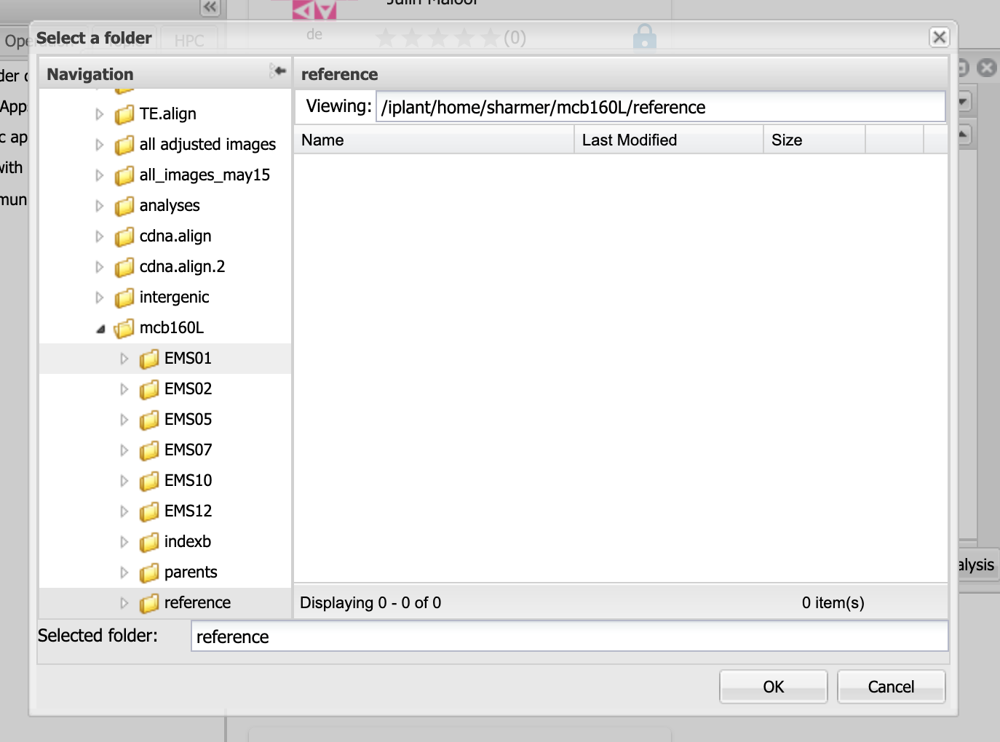
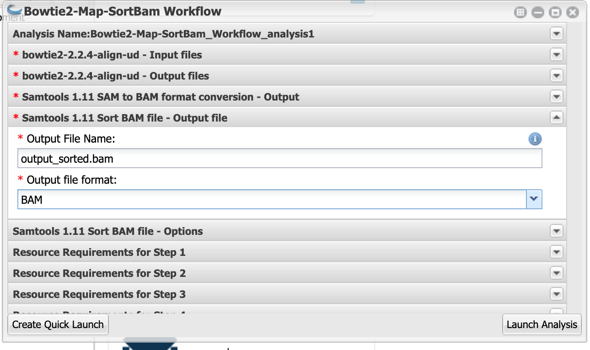

# Mapping mutants by Bulk Segregant Analysis and Illumina Sequencing

## Intro

## Using the CyVerse Discovery Environment (DE)

### Register for an account

### Watch the tutorial

### Knowledge Check

Explain what the "Analyses", "Apps", and "Data" buttons do on the DE desktop

## Add the data folder to your favorites

OOPS FAVORITES MAY NOT WORK

Your life will be __much__ easier if  you create a favorite for the folder that that contains the data for this lab.

Click on `Data`.  The navigate to `Shared with me`.  Scroll down and click on `sharmer`.  Click on the `...` next to the `mcb160l` folder and select `add to favorites` 

## Map reads to Columbia reference genome

Click on Apps

Type `bowtie2` in the search bar and then scroll the results until you find Bowtie2-Map-SortBam Workflow by Reetu Tuteja.

Click on the app name.

### Analysis Name, etc.

You can leave the Analysis Name, Comments, and Output Folder with the default settings.

### Input files

Click on `bowtie2-2.2.4-align-ud - Input files`

For `Bowtie2 index name:` input `TAIR10_chr_all` __Caps matter__ enter it exactly as shown.

For `index folder` click on `Browse` and navigate to `Shared with me > sharmer > mcb160l` and then select `reference` and click OK

Leave `Left reads` and `Right reads` blank

For `Unpaired reads`, click on `Browse` and navigate to `Shared with me > sharmer > mcb160l` and then click on the mutant you were assigned (`EMSXX`).  Finally select the `fastq` file (`EMSXX.fastq` ) and click OK.  (Instead of XX you will have two numbers)

When you are done it should look something like this:

### bowtie2-2.2.4-align-ud - Output files

You can leave `bowtie2-2.2.4-align-ud - Output files` set to its default

### Samtools 1.11 Sort BAM file - Output file

Click on this and select "BAM" for `Output file format`

Now click "Launch Analysis"

You can check on the status by clicking on the Analysis button and then pressing refresh.  Make sure that the status changes to `running` and check back after a few minutes to make sure it is still `running`.  If it switches to `failed` something went wrong.  It will take between 1 and 2 hours to complete, depending on which data set you are using.

(Info about BAM files)

(should run idx stats to assess how well the mapping worked)

## Call SNPs

(Discussion of true SNPs versus errors.  Sources of errors: PCR, sequencer, mapping)

(Discussion of vcf files)

## Run SHOREmap 

We have already identified SNPs where Col and Ler differ for you.  These are in the `insert file name`

This will highlight regions of the genome where the allele frequency skews towards homozygous Columbia.

The app will run the following steps:

* __SHOREmap convert__ will convert the vcf file into a format that SHOREmap understands
* __SHOREmap extract__ will extract the F2 sequence to only retain positions where Col and Ler differ
* __SHOREmap outcross__ actually does the analysis and produced plots to visualize candidate regions

## Run SHOREmap annotate

Which of the possible mutations is likely to actually cause the mutant phenotype?  __SHOREmap annotate__ identifies which candidate SNPS are in genes and predicted to cause coding changes.

## Check read quality

(Info on FastQ file format)

(questions about results)

While your Bowtie2 analysis is running let's check the quality of reads in our fastq file.  (Normally we would do this first, but beacause Bowtie2 takes a long time to run we started it first)