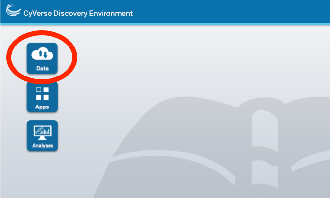
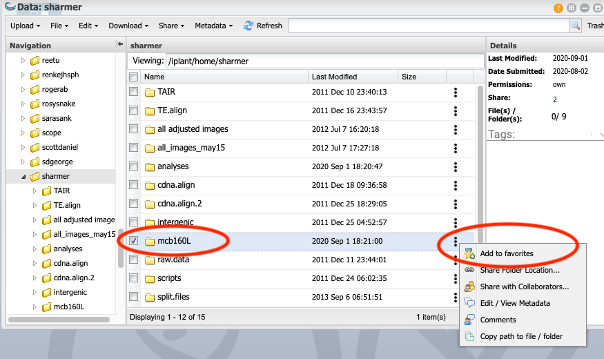
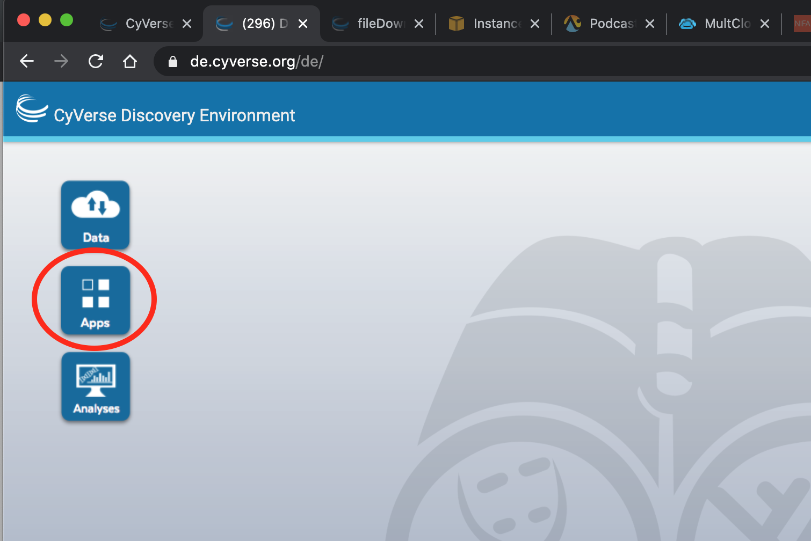
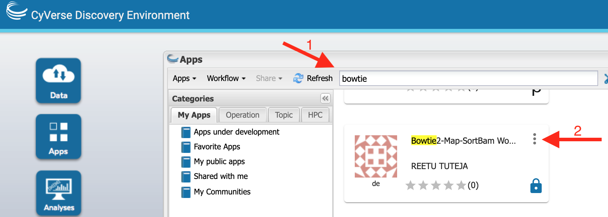
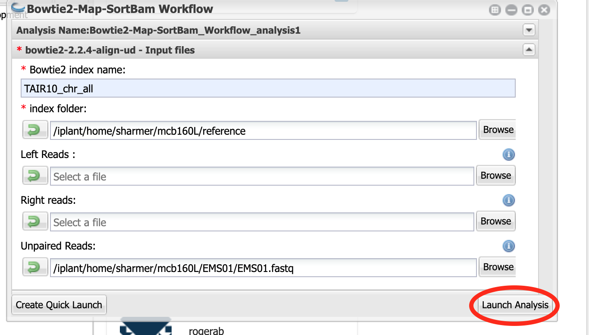

# Mapping mutants by Bulk Segregant Analysis and Illumina Sequencing

## Intro

## Using the CyVerse Discovery Environment (DE)

### Register for an account

### Watch the tutorial

### Knowledge Check

Explain what the "Analyses", "Apps", and "Data" buttons do on the DE desktop

## Add the data folder to your favorites

Your life will be __much__ easier if  you create a favorite for the folder that that contains the data for this lab.

Click on `Data`.  

Then navigate to `Shared with me`.  Scroll down and click on `sharmer`.  

Next, click on the `...` next to the `mcb160l` folder and select `add to favorites` 

--- 

## Map reads to Columbia reference genome

Click on Apps

Type `bowtie2` in the search bar and then scroll the results until you find Bowtie2-Map-SortBam Workflow by Reetu Tuteja.

Click on the app name.

### Analysis Name, etc.

You can leave the Analysis Name, Comments, and Output Folder with the default settings.

### Input files

Click on `bowtie2-2.2.4-align-ud - Input files`

For `Bowtie2 index name:` input `TAIR10_chr_all` __Caps matter__ enter it exactly as shown.

For `index folder` click on `Browse` and navigate to `Shared with me > sharmer > mcb160l` and then select `reference` and click OK.  (Unfortunately the favorites doesn't work to select a folder).

Leave `Left reads` and `Right reads` blank

For `Unpaired reads`, click on `Browse` and then `Favorites`, then click on the mutant you were assigned (`EMSXX`).  Finally select the `fastq` file (`EMSXX.fastq` ) and click OK.  (Instead of XX you will have two numbers).  (Or if you don't have favorites set up, then navigate to `Shared with me > sharmer > mcb160l` and continue as above)

When you are done it should look something like this:

### bowtie2-2.2.4-align-ud - Output files

You can leave `bowtie2-2.2.4-align-ud - Output files` set to its default

### Samtools 1.11 Sort BAM file - Output file

Click on this and select "BAM" for `Output file format`

Now click "Launch Analysis"

You can check on the status by clicking on the Analysis button and then pressing refresh.  Make sure that the status changes to `running` and check back after a few minutes to make sure it is still `running`.  If it switches to `failed` something went wrong.  It will take between 1 and 2 hours to complete, depending on which data set you are using.

(Info about BAM files)

(should maybe run flagstat to assess how well the mapping worked)

---
## Check read quality

(Info on FastQ file format)

(questions about results)

While your Bowtie2 analysis is running, check the quality of reads in your fastq file.  (Normally we would do this first, but because Bowtie2 takes a long time to run we started it first)

__STILL NEED TO FILL THIS IN__

---

## Call SNPs

(Discussion of true SNPs versus errors.  Sources of errors: PCR, sequencer, mapping)

(Discussion of vcf files)

We next want to find those positions where the reads from our F2s differ from the reference genome, and where they match.  We will use `bcftools mpileup and call`.  `bcftools mpileup` counts up all the reads at each position in the genome and tallies how many match the reference and how many are different.  `bcftools call` then takes this information and computes statistics to determine the likelihood of _true_ variation (as opposed to sequencing error) at each location.  

Click on the `Apps` button and search for "bcftools 1.10 mpileup".  Select the `bcftools 1.10 mpileup and call` app by Julin Maloof.

You can leave the first part (Analysis name and output folder as default)

### BCFtools 1.10 mpileup - Input data

Here you want to use the bam file that you created by running bowtie above.  

Click the "add" button, navigate to your `analyses` folder, click on the `Bowtie2-Ma-SortBam...` folder and then select the `output_sorted.bam` file and click OK

Once you have it selected the window should look like this:

### BCFtools 1.10 mpileup - Input options

For `faidx indexed reference sequence file:`  Click `Browse` then `favorites > mcb160L > reference ` and select the file `TAIR10_chr_all.fas` and click `OK`.

The rest of this section can be left blank.

Once you have the file selected your window should look like this:

### Skip down to BCFtools 1.10 call - File format options

Add `.vcf` to the end of the output file name, to that you have `bcftools_call_output.vcf`

Change file type to `Uncompressed VCF`

Leave Regions file, Samples file, and Targets file all blank

### BCFtools 1.10 call - Filter options

Click "Keep alternative alleles"

### Launch it

Now click `Launch Analysis`

As before, click on the `Analyses` button and click `refresh` a few times to make sure it is running didn't fail in the first few minutes.
 
---
 ## IGV
 
 __STILL NEED TO COMPLETE THIS__
 
 ---
 
## Run SHOREmap 

We have already identified SNPs where Col and Ler differ for you.  These are in the `insert file name`

This will highlight regions of the genome where the allele frequency skews towards homozygous Columbia.

The app will run the following steps:

* __SHOREmap convert__ will convert the vcf file into a format that SHOREmap understands
* __SHOREmap extract__ will extract the F2 sequence to only retain positions where Col and Ler differ
* __SHOREmap outcross__ actually does the analysis and produced plots to visualize candidate regions

---

## Run SHOREmap annotate

Which of the possible mutations is likely to actually cause the mutant phenotype?  __SHOREmap annotate__ identifies which candidate SNPS are in genes and predicted to cause coding changes.

