# Mapping mutants by Bulk Segregant Analysis and Illumina Sequencing
# Day 1: Map Reads to a Reference Genome

## Using the CyVerse Discovery Environment (DE)

As you learned in lecture, the Cyverse Discovery Environment allows biologists without advanced coding skills to take advantage of bioinformatics algorithms and advanced computing resources via a point-and-click environment.

Although there are many advantages to using these algorithms via the command line, we will take advantage of the Discovery Environment so that you can get experience analzying Next Generation Sequencing data without needing to learn anything about coding.

The process of porting the specialized mapping software we'll be using (SHOREmap) to the Discovery Environment was accomplished by the generous efforts of Julin Maloof (UC Davis), Reetu Tuteja (CyVerse), and Hequan Sun (Max Planck Institute for Plant Breeding Research, Germany).

### Get started with the Discovery Environment

Go to the [Cyverse](https://www.cyverse.org) home page and launch the Discovery Environment.

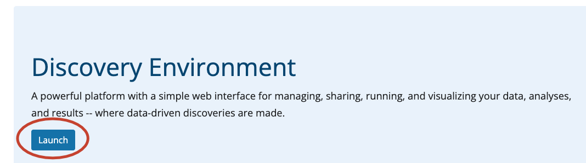

And log in to your account

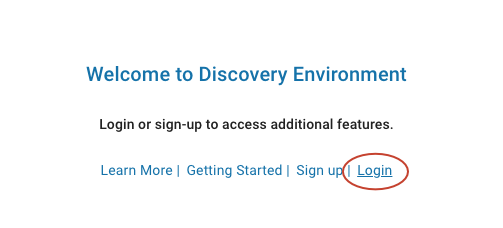

#### Worksheet activity

1. Explain what the "Analyses", "Apps", and "Data" buttons in the sidebar do on the DE desktop

---

## Map reads to Columbia reference genome

Click on Apps in the sidebar

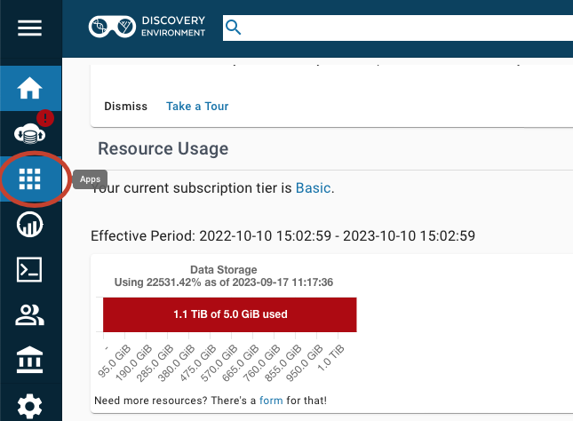

Type `bowtie2` in the search bar and then scroll through the results until you find Bowtie2-Map-SortBam Workflow by Reetu Tuteja.  Select that tool.

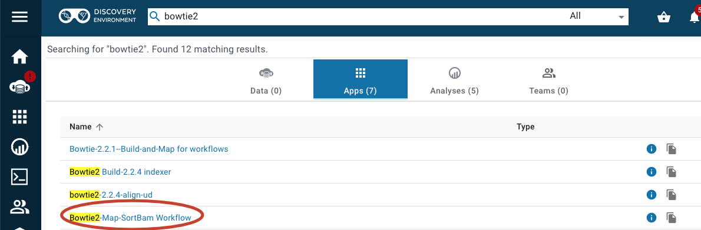  

Click on the details button in the upper right corner.

 

And then click on MCB160L and then the arrow to Quick Launch the application

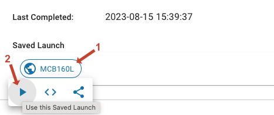

Click on the main 'Bowtie2-Map-SortBam Workflow' page to prepare for your analysis.

### Analysis Name, etc.

You can leave the Analysis Name, Comments, and Output Folder with the default settings.  Click on 'Next' to go to the next page.

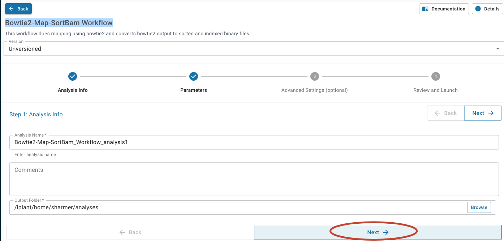

### Input files

`Bowtie2 index name:` tells the aligner the name of the indexed genome file.  We have filled this in for you, it should read `TAIR10_chr_all`

`index folder` tells the aligner where to find the indexed genome files.  We have filled this in for you.

Leave `Left reads` and `Right reads` blank

For `Unpaired reads`, we need to tell the aligner where to find the FASTQ files for your mutant. First click on 'Browse'  

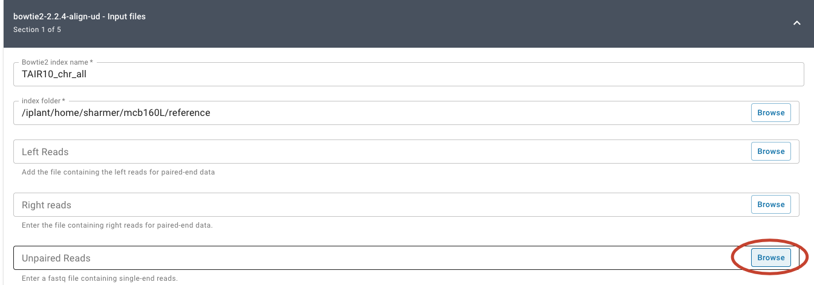

 and then  navigate to `Shared with me`. 
 
 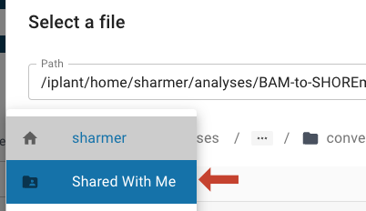

  Scroll down and click on `sharmer`.

 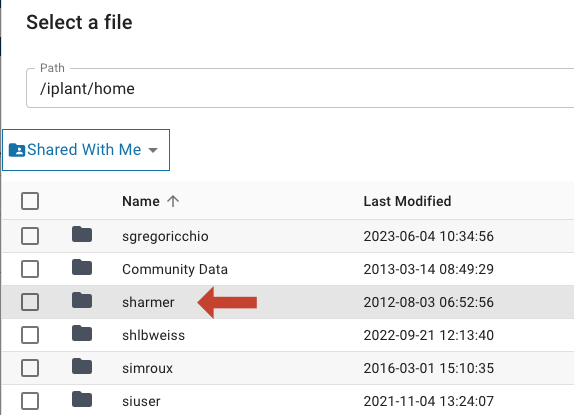

Next click on `mcb160l`, and then the mutant you were assigned (`EMSXX`).  Finally select the `fastq` file (`EMSXX.fastq` ) and click OK.  (Instead of XX you will have two numbers).

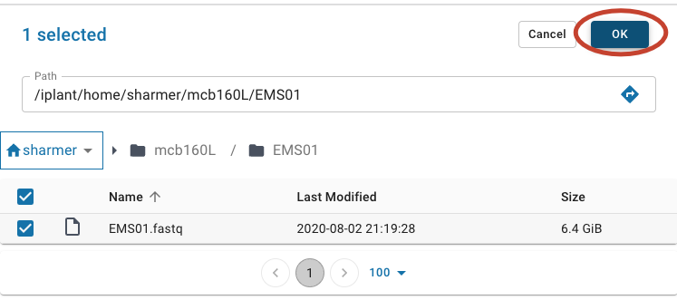

When you are done it should look something like this:

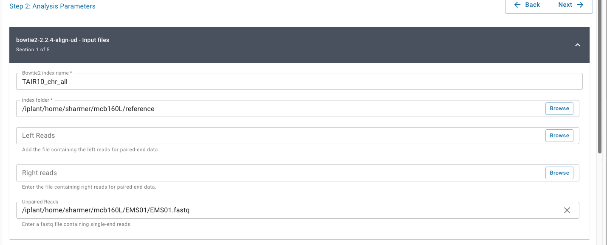

The rest of the pages can be left with their default values.  Click on the 'Next' button twice more to get to the Review and Launch page. 

It is now time to launch the analysis!  Click "Launch Analysis" at the bottom right of the window.

You can check on the status by clicking on the Analysis button and then pressing refresh.  Make sure that the status changes to `running` and check back after a few minutes to make sure it is still `running`.  If it switches to `failed` something went wrong.  It will take between 1 and 2 hours to complete, depending on which data set you are using.

#### Worksheet activities

2. What is the Input file 'reference' that you specified when setting up Bowtie2? Why do you need this file?

3. Think of four different types of information that you think your output file (BAM file) should contain for each read. What are they?

---
## Assessing read quality

Remember from lecture that the PHRED score provides information on the probability that the identity of each base has been called correctly, with the below ASCII code corresonding to the indicated PHRED values.

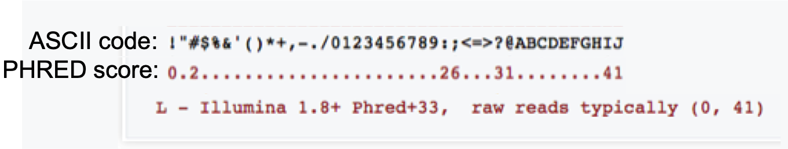

Recall also that each numeric PHRED score (Q) can be converted to the probability that the base call is **incorrect** (P) using the below equation:

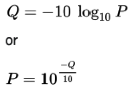

#### Worksheet activities

4. For the below FASTQ entry, calculate the probability of an incorrect call for the first two and the last two bases in this sequence.

5. Provide one possible explanation for the difference in probabilities at the beginning and the end of this sequence.

## Examine read quality of *your* data

While your Bowtie2 analysis is running, check the quality of reads in your fastq file.  (Normally we would do this first, but because Bowtie2 takes a long time to run we started it first)

### Run FastQC

Here we use a program called `FastQC`.

Click on your `Apps` button and enter `fastqc` in the search bar.  Scroll until you find `FastQC 0.11.5 (multi-file)` by Upendra Kumar Devisetty.

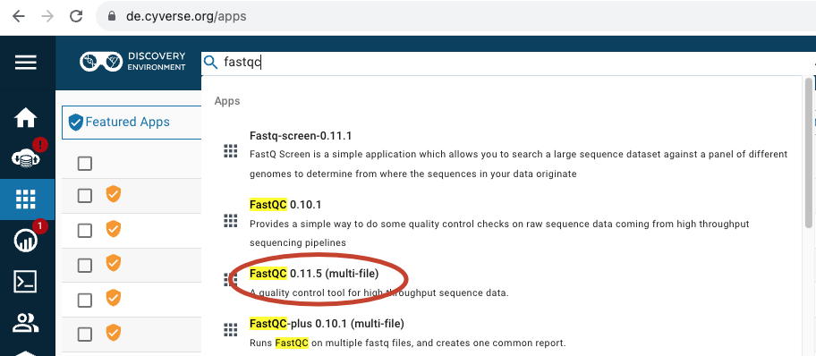

Instead of using a QuickLaunch, just click on the app title to launch it.

Click 'Next' to get to the 'Analysis Parameters' page. Under the Input section, click on the 'Browse' button.

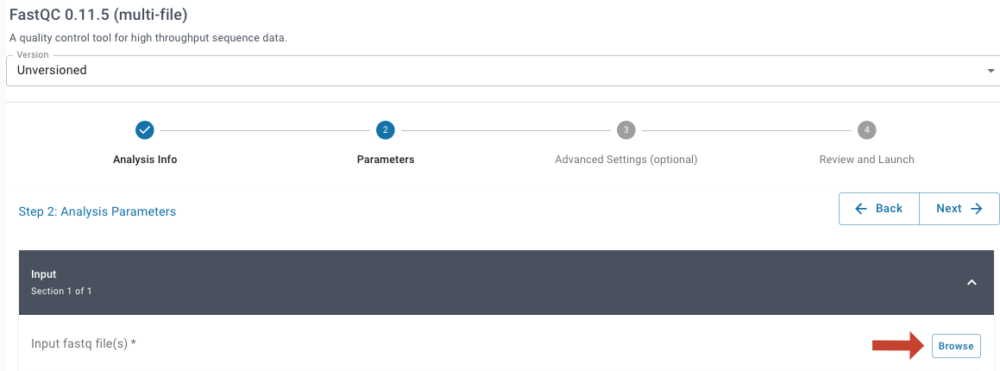

Navigate to the same fastqc file you used in the step above. The site should remember the same filepath you used previously.  (In case it doesn't, click on `Shared with me`.  Scroll down and click on `sharmer`. Next click on `mcb160l`, and then the mutant you were assigned (`EMSXX`).  Finally select the `fastq` file (`EMSXX.fastq` ) and click OK.)

When you are done your input box should look like this:

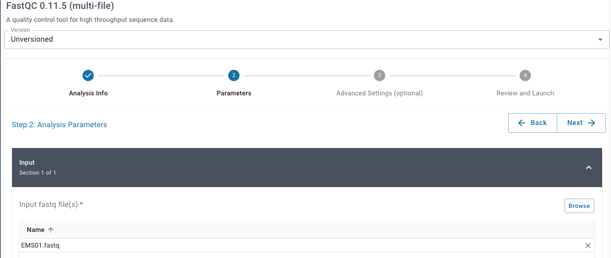

We don't need to change any other settings. Click 'Next' twice to get to the 'Review and Launch' page.  Lauch by clicking on `Launch Analysis`

This can take 5 to 10 minutes to run.

### Look at the results.

Click on the Analyses button and then click on refresh.  When the FastQC...analyses status switches to complete, click on the 3 dots filename.

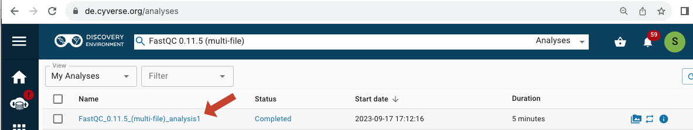

Next click on the file name listed next to 'Output folder'.

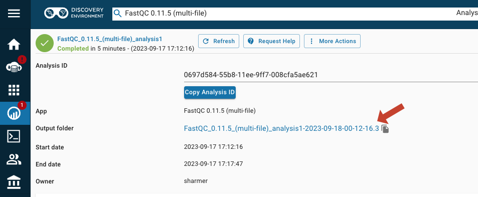

 Finally, click on the `EMSXX_fastqc.html` file name
 
 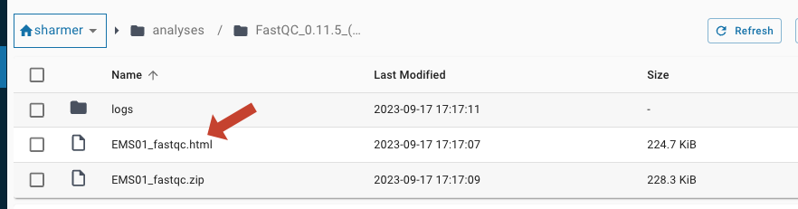

 and it will open your report in a new window in your browser.

 #### Worksheet activities

 Answer questions #6 - 11 on your worksheet using the information in this report.
