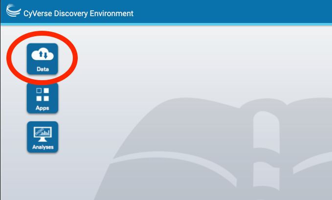
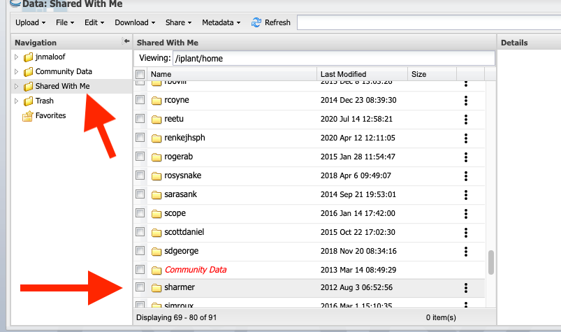
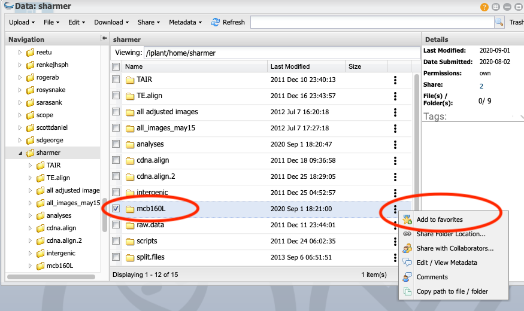
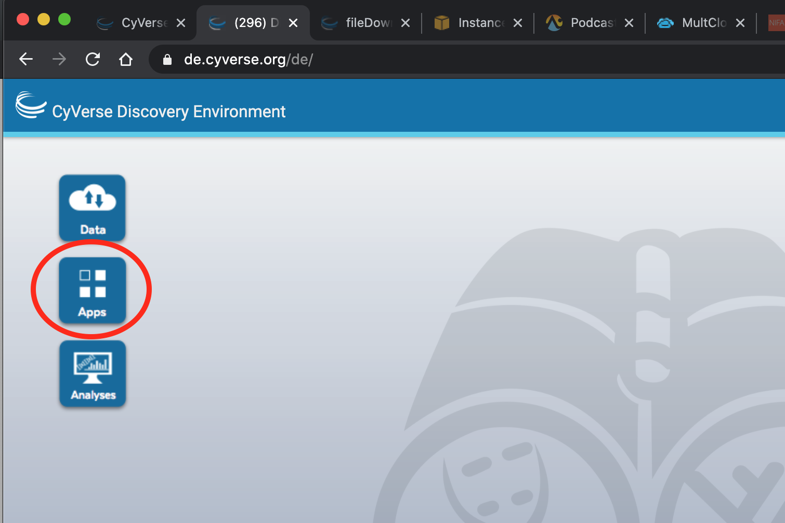
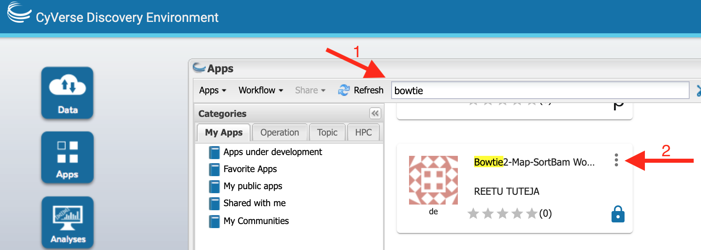
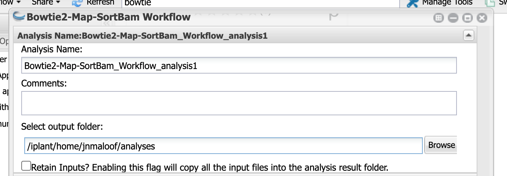
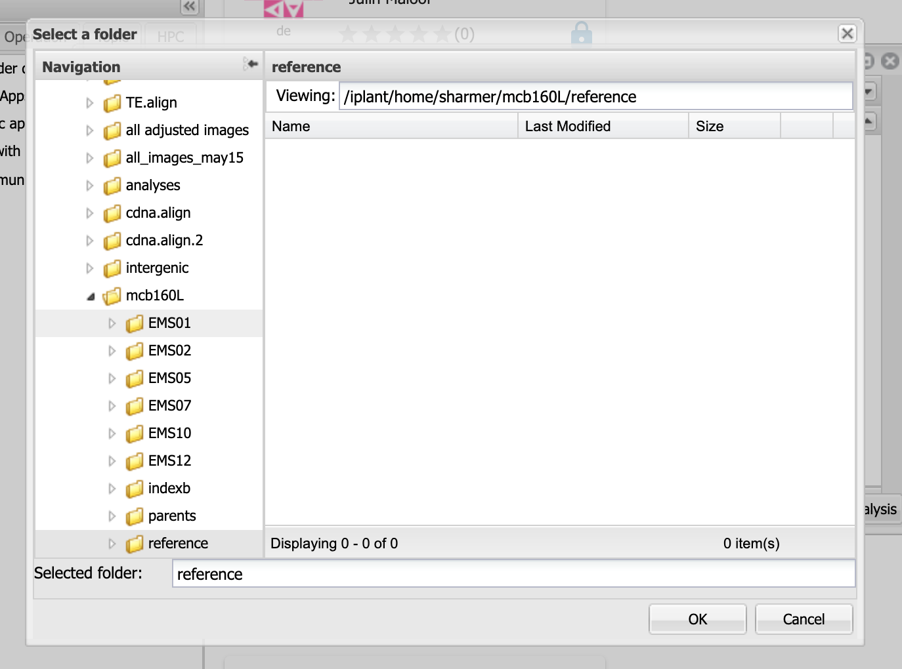
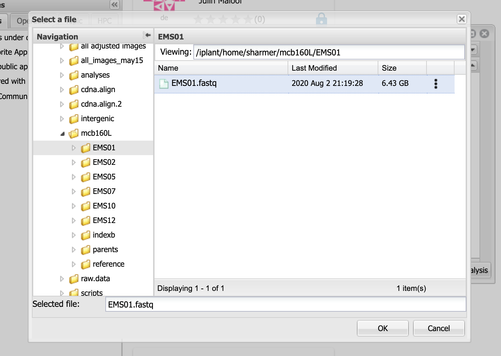
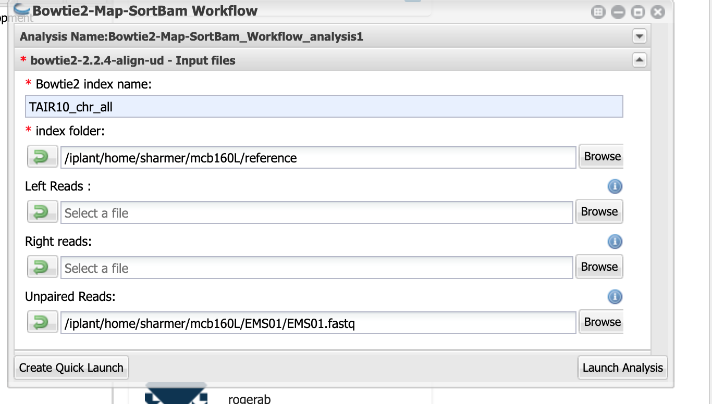
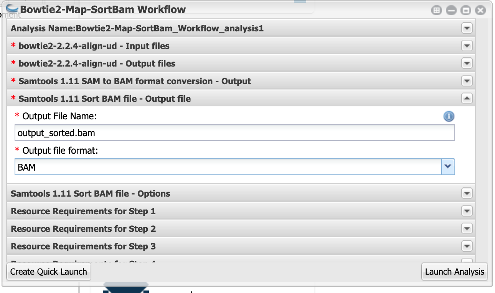

# Mapping mutants by Bulk Segregant Analysis and Illumina Sequencing
# Day 1: Map Reads to a Reference Genome

## Intro

## Using the CyVerse Discovery Environment (DE)

### Register for an account

### Watch the tutorial

### Knowledge Check

Explain what the "Analyses", "Apps", and "Data" buttons do on the DE desktop

## Add the data folder to your favorites

Your life will be __much__ easier if  you create a favorite for the folder that that contains the data for this lab.

Click on `Data`.  

Then navigate to `Shared with me`.  Scroll down and click on `sharmer`.  

Next, click on the `...` next to the `mcb160l` folder and select `add to favorites` 

--- 

## Map reads to Columbia reference genome

Click on Apps

Type `bowtie2` in the search bar and then scroll the results until you find Bowtie2-Map-SortBam Workflow by Reetu Tuteja.

Click on the app name.

### Analysis Name, etc.

You can leave the Analysis Name, Comments, and Output Folder with the default settings.

### Input files

Click on `bowtie2-2.2.4-align-ud - Input files`

For `Bowtie2 index name:` input `TAIR10_chr_all` __Caps matter__ enter it exactly as shown.

For `index folder` click on `Browse` and navigate to `Shared with me > sharmer > mcb160l` and then select `reference` and click OK.  (Unfortunately the favorites doesn't work to select a folder).

Leave `Left reads` and `Right reads` blank

For `Unpaired reads`, click on `Browse` and then `Favorites`, then click on the mutant you were assigned (`EMSXX`).  Finally select the `fastq` file (`EMSXX.fastq` ) and click OK.  (Instead of XX you will have two numbers).  (Or if you don't have favorites set up, then navigate to `Shared with me > sharmer > mcb160l` and continue as above)

When you are done it should look something like this:

### bowtie2-2.2.4-align-ud - Output files

You can leave `bowtie2-2.2.4-align-ud - Output files` set to its default

### Samtools 1.11 Sort BAM file - Output file

Click on this and select "BAM" for `Output file format`

Now click "Launch Analysis"

You can check on the status by clicking on the Analysis button and then pressing refresh.  Make sure that the status changes to `running` and check back after a few minutes to make sure it is still `running`.  If it switches to `failed` something went wrong.  It will take between 1 and 2 hours to complete, depending on which data set you are using.

(Info about BAM files)

(should maybe run flagstat to assess how well the mapping worked)

---
## Check read quality

(Info on FastQ file format)

(questions about results)

While your Bowtie2 analysis is running, check the quality of reads in your fastq file.  (Normally we would do this first, but because Bowtie2 takes a long time to run we started it first)

__STILL NEED TO FILL THIS IN__
