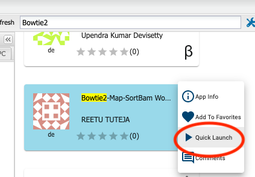
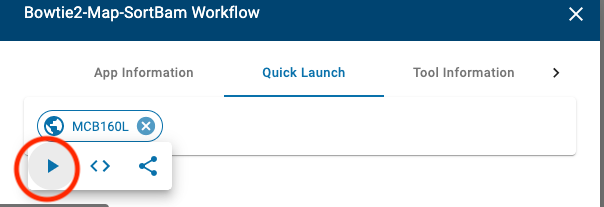
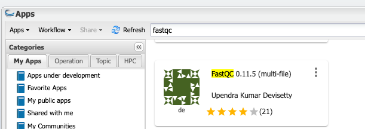
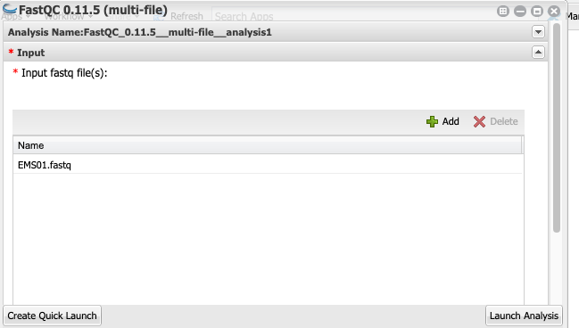
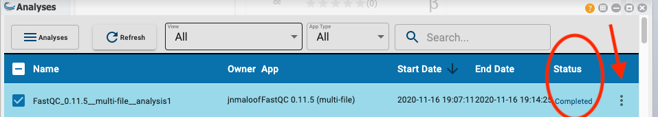
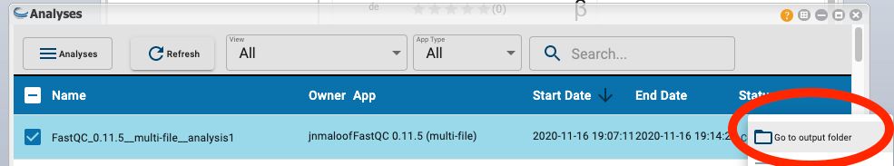

# Mapping mutants by Bulk Segregant Analysis and Illumina Sequencing
# Day 1: Map Reads to a Reference Genome

## Intro

## Using the CyVerse Discovery Environment (DE)

### Register for an account

### Watch the tutorial

### Knowledge Check

Explain what the "Analyses", "Apps", and "Data" buttons do on the DE desktop

--- 

## Map reads to Columbia reference genome

Click on Apps

Type `bowtie2` in the search bar and then scroll through the results until you find Bowtie2-Map-SortBam Workflow by Reetu Tuteja.

Click on the 3 dots to the right of the app name.

Click on Quick Launch

Click on MCB160L and then the arrowhead

### Analysis Name, etc.

You can leave the Analysis Name, Comments, and Output Folder with the default settings.

### Input files

Click on `bowtie2-2.2.4-align-ud - Input files`

`Bowtie2 index name:` tells the aligner the name of the indexed genome file.  We have filled this in for you, it should read `TAIR10_chr_all`

`index folder` tells the aligner where to find the indexed genome files.  We have filled this in for you.  

Leave `Left reads` and `Right reads` blank

For `Unpaired reads`, we need to tell the aligner where to find the FASTQ files for your mutant.  click on `Browse` and then  navigate to `Shared with me`.  Scroll down and click on `sharmer`.  

Next click on `mcb160l`, and then the mutant you were assigned (`EMSXX`).  Finally select the `fastq` file (`EMSXX.fastq` ) and click OK.  (Instead of XX you will have two numbers). 

When you are done it should look something like this:

The rest of the pages can be left with their default values.  It is time to launch the analysis!  Click "Launch Analysis" at the bottom right of the window.

You can check on the status by clicking on the Analysis button and then pressing refresh.  Make sure that the status changes to `running` and check back after a few minutes to make sure it is still `running`.  If it switches to `failed` something went wrong.  It will take between 1 and 2 hours to complete, depending on which data set you are using.

(Info about BAM files)

(should maybe run flagstat to assess how well the mapping worked)

---
## Check read quality

(Info on FastQ file format)

(questions about results)

While your Bowtie2 analysis is running, check the quality of reads in your fastq file.  (Normally we would do this first, but because Bowtie2 takes a long time to run we started it first)

### Run FastQC

Here we use a program called `FastQC`.

Click on your `Apps` button and enter `fastqc` in the search bar.  Scroll until you find `FastQC 0.11.5 (multi-file)` by Upendra Kumar Devisetty.

Instead of using a QuickLaunch, just click on the app title to launch it.

Click on `Input` and then "Add".  Navigate to the same fastqc file you used in the step above by clicking on `Shared with me`.  Scroll down and click on `sharmer`.  

Next click on `mcb160l`, and then the mutant you were assigned (`EMSXX`).  Finally select the `fastq` file (`EMSXX.fastq` ) and click OK.

When you are done your input box should look like this:

Now you can launch by clicking on `Launch Analysis`

This will take about 1 minute to run.

### Look at the results.

Click on the Analyses button and then click on refresh.  When the FastQC...analyses status switches to complete, click on the 3 dots to the right

Next click on `Go to output folder`
 
 
 
 Finally, click on the `EMSXX_fastqc.html` file and it will open your report in a new window in your browser.

