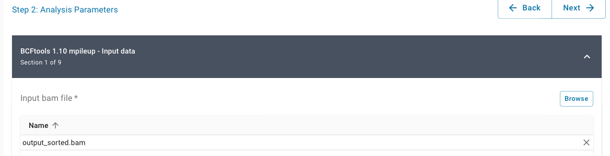
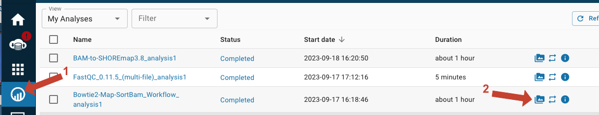
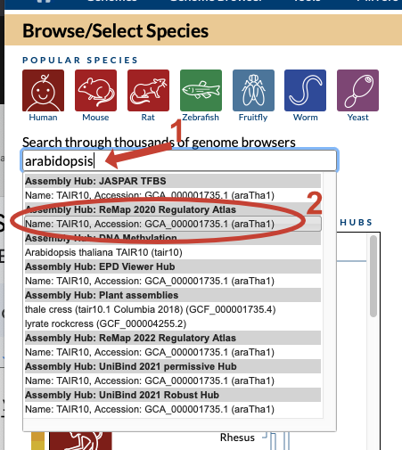
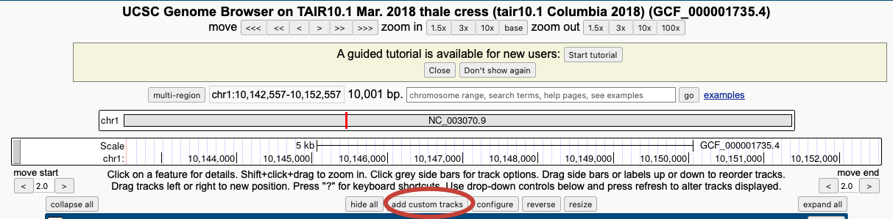

# Mapping mutants by Bulk Segregant Analysis and Illumina Sequencing
# Day 2: Find SNPs and View Reads in a Genome Browser

## Intro

In today's lab, you'll do the following:
1) manipulate the file that you generated in the last lab (the BAM file, with the  reads from your mutant aligned to the Col reference genome) so it can be used by the SHOREmap mapping software the next time we meet
2) Use the UC Santa Cruz Genome Browser to:
    **a**.  determine how well the reads from your mutant (EMSXX) are aligned to the reference genome using the UC Santa Cruz Genome Browser.
    **b**.  inspect sequence differences between the reference genome (Col) and the genome of a different strain of Arabidopsis (Ler)

## Call Single Nucleotide Polymorphisms (SNPs)

Last time, we aligned the reads obtained from sequencing our F2 mutant plants to the reference Arabidopsis genome (the strain Columbia, or Col) to generate a BAM file. Today, we will find those positions where the reads from our F2s differ from the reference genome, and where they match.  We will use the tools `bcftools mpileup and call` and  `SHOREmap convert`.

 1) `bcftools mpileup` counts up all the reads at each position in the genome and tallies how many match the reference and how many are different.

 2) `bcftools call` then takes this information and computes statistics to determine the likelihood of _true_ variation (as opposed to sequencing error) at each location.  These programs produce a `vcf` file, a common format for genomic SNP information.

 3) `SHOREmap convert`, as its name suggests, will convert the vcf file to a format that can be understood by our mapping program, SHOREmap.

We have combined the bcftools mpileup, call, and SHOREmap convert into a single app that will run these steps together. (_In the command line, you would need to invoke each program one at a time._)

Click on the `Apps` button and search for "BAM-to-SHORE".

 

 Select that tool.  Click on the details button in the upper right corner.

 

And then click on MCB160L and then the arrow to Quick Launch the application

 

Click on the main 'BAM-to-SHOREmap3.8' page to prepare for your analysis.

### BCFtools 1.10 mpileup - Input data

You can leave the first part (Analysis name and output folder) with the default values.

Click on 'Next' to go to the next page.

Select the 'Browse' button to input the BAM file that you created by running Bowtie in the previous session.

Navigate to your `analyses` folder by typing 'analyses' into the filepath after your username.

Click on the `Bowtie2-Map-SortBam...` folder and then select the `output_sorted.bam` file and click OK

Once you have it selected the window should look like this:

### Launch it

Click 'Next' two more times. The remaining settings can be left at their default values.

Time to launch! Click `Launch Analysis`

As before, click on the `Analyses` button and click `refresh` a few times to make sure it is running didn't fail in the first few minutes.

**This will take 1-2 hours to run (closer to 2 hours for most data sets); we'll work with the output in our next lab**

### Inspect the settings

Now that your analysis is running, let's look more closely at what we just did.

Again, start BAM-to-SHOREmap3.8 using the quick launch settings. Search for the tool, select it, and click on the details button in the upper right corner.

 

And then click on MCB160L and then the arrow to Quick Launch the application

 

Click on the main 'BAM-to-SHOREmap3.8' page.

Then, select `MCB160L` from the quick launch menu and click on the arrowhead.

Click the 'Next' button to check out the settings specified in the quick launch and use that information to answer the below questions.

**Please answer the below questions in today's worksheet.**

1. Scroll down on page 2 ('Parameters') to see what was entered under `bcftools mpileup - Output options` tab.  What is the selected output type? And from what you learned in today’s lecture, what do you think are the two most important types of information contained in this output file?
2.  Scroll down further to see what is listed under the `bcftools call - Consensus/variant calling options` section. What is the default ‘variant calling method’?  And what is the other possible method?
3.  What do you think these two options might mean? And why do you think it is important that we used the default method here?  (_Keep in mind that the Illumina library that you are analyzing was generated from pooled genomic DNA extracted from ~200 different plants._)
4. Scroll down further to see what is listed under the `SHOREmap convert - Parameters` section. Find the ‘minimum AF’ that has been specified for you and write it down below. (_AF stands for ‘Allele Frequency’._) How do you think this relates to the ‘variant calling method’ specified in `bcftools call` and what do you think this parameter does?

---
 ## Inspect your aligned reads using the UC Santa Cruz Genome Browser

Next, you will examine how well the sequencing reads from your mutant F2 plants were aligned to the Arabidopsis reference genome. (_Recall that the strain called Col was sequenced to generate this reference sequence_.)

 We have discussed the many ways in which errors can be generated in Illumina sequencing reads. Since we're using Illumina data to map a mutant, it is important for us to be able to distinguish 'real' polymporphisms present in our starting pooled genomic DNA sample from errors generated during the sequencing process.

The algorithms that we're working with examine both read quality (e.g. PHRED scores, as discussed last time) and the number of times a specific polymporphism is detected in our library to help distinguish real polymorphisms from random errors.

 We'll get a sense for how this works by loading the BAM file you generated in our last lab in the [UC Santa Cruz Genome Browser](https://genome.ucsc.edu/) and looking at the aligned reads.

 1) First, go to the Discovery Environment and **obtain a URL that links to your BAM file**.  Navigate to your `analyses` folder, and click on the link to the output folder for `Bowtie2-Map-SortBam...` folder. 

 

 Next,  then click on the three dots to the far right on the `output_sorted.bam` file line. Click on the 'Public Link(s)' button.

  

You'll then get a pop-up window with a URL. **Paste this address into your worksheet (this is question 5**) and save it; you'll need it below (and you'll also need it again next week).
  

2) Next, navigate to the [UC Santa Cruz Genome Browser](https://genome.ucsc.edu/) to **set up the display settings and load your custom data.**  Cick on `Genome Browser` in the header menu, then select 'Reset All User Settings'.

Type 'arabidopsis' into the search window; select the 'thale cress (tair10.1 Columbia 2018)' genome listed under the **Assembly Hub: Plant assemblies** line.  _Be sure you select this one even though other lines have similar names!_

The "thale cress (tair10.1 Columibia 2018)" annotation should autopopulate in the 'Plant assemblies Hub Assembly' bar.  Be sure that this is the name diplayed before you click 'Go'!

Warning - the browser window will look very confusing at first!  We will simplify the view.

Click the 'hide all' button just below the white window.

Ah, that's better! Now we'll add a custom track that includes the sequences from your mutant aligned to the reference genome.

Click on the 'add custom tracks' button

And paste in the URL you obtained from the DE in the top box in the next window.  Click 'submit'.

You should be taken to a page that looks like the below image.  Click on 'go to first annotation'.

3) **Examine your aligned reads.**  To see them, click on the 'plus' symbol on the left side of the blue bar labeled 'Custom Tracks'.  Choose the 'pack' display option under the display options pull-down menu.

Write in the locus name *XCT* in the search bar near the top of display, just to restrict your view to a small part of the genome.

Then click the 'refresh' button on the rights side of the blue 'Custom' bar.

Click on the XCT hyperlink for "RefSeq mRNAs mapped to this assembly".  You should now see the genome browser page again.

Navigate within the Genome Browser to answer the below questions on your worksheet. Remember to use the navigation controls at the top of the page zoom in and out, and to move your field of view to the left and the right.

**More worksheet questions**

6) What do you think the vertical red line at the top of the page represents? (*Hint: try entering new position coordinates in the search bar at the top of the page.*)
7) What do the red rectangles separated by horizontal lines at the bottom of the plot represent?  Why are there small arrowheads on these horizontal lines?
8) Note the skinny red rectangles at the farthest left and right portions of each gene model. What do these represent? (*Their positions should give you a big hint.*)
9) The brown and blue boxes in the middle of the plot represent individual sequencing reads from your library.  Click on a few to see the corresponding portion of the BAM file for each read.  Why are some reads indicated in blue and some in brown?

Go back to your browswer view. Zoom in to the base level (see 'base' button just to the left of 'zoom out' in the navigation area). Find a sequence read (either a brown or a blue rectangle) that has white nucleotide displayed within it. Click on this read. (*You may have to scan to left or right to find one.*)

10) Look at the BAM entry for this sequence read. Identify the polymorphic base and write in its sequence and that of the 3 bases on either side on your worksheet (do this for both your sequence read and the reference). Circle or highlight the mismatched bases.
11) Find the quality score for this base in your sequencing read and write it in below. Using the formula from last lab, calculate the probability that this base call is not correct. Based on this value, do you believe this is a true polymorphism?
12) Does anything else in your genome browser view suggest whether or not this represents a true polymorphism between your pooled F2 genomic DNA and the reference genome? Explain.

---
 ## Examine polymorphisms between Ler and Columbia

 Recall that you'll be mapping your mutation using markers (SNPs) that are different between the Col and Ler strains of Arabidopsis.  We can use the Genome Browser to see just how common such polymorphisms are.

You will generate a new custom track in the UC Santa Cruz Genome Browser to view  Ler reads generated in a separate experiment.  On your Genome Browser page, click the 'manage custom tracks' button.

Now, click on the 'add custom tracks' buttons in the next window.

And then paste this URL

 https://data.cyverse.org/dav-anon/iplant/home/sharmer/mcb160L/parents/Ler/Ler_sorted.bam

 into the to entry box.  It should look like the below image.  Hit 'submit'.

Now on the next page click 'go to first annotation' to return to the Genome Browser.

Change the settings under the blue bar labeled 'Custom' (as you did previously). Hide your F2 BAM file and set the Ler BAM file to display as 'pack'.  Click 'refresh'.

Type in the gene name ELF4 in the top search bar and click 'go'.

Choose the top RefSeq mRNA link (ELF4 - NC_003071.7:16734294-16734875) on the next page.

Using the zoom and scan controls, find a position within the ELF4 coding region where you think there may be two true sequence polymorphism (SNP) between Ler and Col within 50 bp of each other.

13) Click on a read to see the alignment between Col and Ler around these putative SNPs.  Write out the sequence of the first candidate SNP and that of the 3 bases on either side (do this for both your sequence read and the reference). Circle or highlight the mismatched bases. Explain why you think this may be a true polymorphism (SNP) rather than a sequencing error.

Zoom out with the 10x button. Scan left and right and examine the frequency of continuous vertical red lines; these are positions where the sequences of most/all reads fail to match the reference genome.

14) What do you conclude about the frequency of SNPs between Col and Ler?

---
**_In our next lab, you will identify genomic regions and candidate genes that may be responsible for the miRNA phenotype in your mutant plants._**
