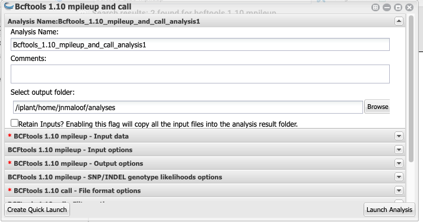
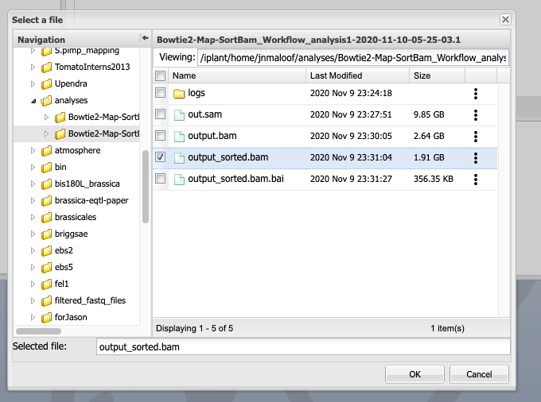
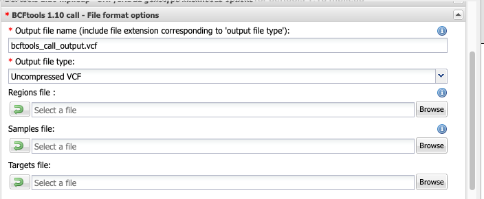

# Mapping mutants by Bulk Segregant Analysis and Illumina Sequencing
# Day 2: Find SNPs and View Reads in a Genome Browser

## Intro

## Call SNPs

(Discussion of true SNPs versus errors.  Sources of errors: PCR, sequencer, mapping)

(Discussion of vcf files)

We next want to find those positions where the reads from our F2s differ from the reference genome, and where they match.  We will use `bcftools mpileup and call`.  `bcftools mpileup` counts up all the reads at each position in the genome and tallies how many match the reference and how many are different.  `bcftools call` then takes this information and computes statistics to determine the likelihood of _true_ variation (as opposed to sequencing error) at each location.  

Click on the `Apps` button and search for "bcftools 1.10 mpileup".  Select the `bcftools 1.10 mpileup and call` app by Julin Maloof.

You can leave the first part (Analysis name and output folder as default)

### BCFtools 1.10 mpileup - Input data

Here you want to use the bam file that you created by running bowtie above.  

Click the "add" button, navigate to your `analyses` folder, click on the `Bowtie2-Ma-SortBam...` folder and then select the `output_sorted.bam` file and click OK

Once you have it selected the window should look like this:

### BCFtools 1.10 mpileup - Input options

For `faidx indexed reference sequence file:`  Click `Browse` then `favorites > mcb160L > reference ` and select the file `TAIR10_chr_all.fas` and click `OK`.

The rest of this section can be left blank.

Once you have the file selected your window should look like this:

### Skip down to BCFtools 1.10 call - File format options

Add `.vcf` to the end of the output file name, to that you have `bcftools_call_output.vcf`

Change file type to `Uncompressed VCF`

Leave Regions file, Samples file, and Targets file all blank

### BCFtools 1.10 call - Filter options

Click "Keep alternative alleles"

### Launch it

Now click `Launch Analysis`

As before, click on the `Analyses` button and click `refresh` a few times to make sure it is running didn't fail in the first few minutes.

This will take between 40 minutes and one hour to run.
 
---
 ## IGV
 
 __STILL NEED TO COMPLETE THIS__
 