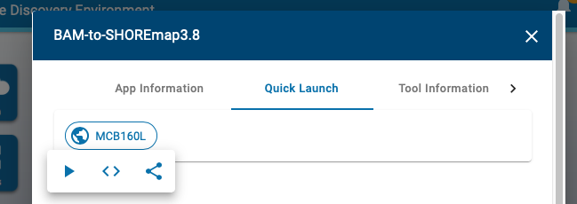

# Mapping mutants by Bulk Segregant Analysis and Illumina Sequencing
# Day 2: Find SNPs and View Reads in a Genome Browser

## Intro

## Call SNPs

(Discussion of true SNPs versus errors.  Sources of errors: PCR, sequencer, mapping)

(Discussion of vcf files)

We next want to find those positions where the reads from our F2s differ from the reference genome, and where they match.  We will use `bcftools mpileup and call`.  `bcftools mpileup` counts up all the reads at each position in the genome and tallies how many match the reference and how many are different.  `bcftools call` then takes this information and computes statistics to determine the likelihood of _true_ variation (as opposed to sequencing error) at each location.  These programs produce a `vcf` file, a common format for genomic SNP information.

We also will convert the vcf file to a format that can be understood by our mapping program, SHOREmap.

We have combined the bcftools mpileup, call, and SHOREmap convert into a single app that will run these steps together.

Click on the `Apps` button and search for "BAM-to-SHORE".

Next click on the three buttons to the right of the `BAM-to-SHOREmap` application and then select `Quick Launch`.

Finally, select `MCB160L` from the quick launch menu and click on the arrowhead.

You can leave the first part (Analysis name and output folder as default)

### BCFtools 1.10 mpileup - Input data

Click on `BCFtools 1.10 mpileup - Input data`

Here you want to use the bam file that you created by running Bowtiew in the previous session.  

Click the "add" button, navigate to your `analyses` folder, click on the `Bowtie2-Map-SortBam...` folder and then select the `output_sorted.bam` file and click OK

Once you have it selected the window should look like this:

### Launch it

The remaining settings can be left at their default values.

Time to launch! Click `Launch Analysis`

As before, click on the `Analyses` button and click `refresh` a few times to make sure it is running didn't fail in the first few minutes.

This will take 1-2 hours to run (closer to 2 for most data sets)

---
 ## IGV

 __STILL NEED TO COMPLETE THIS__
