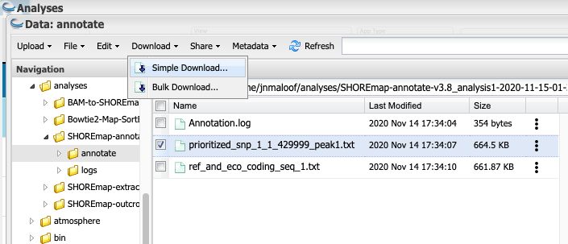

# Mapping mutants by Bulk Segregant Analysis and Illumina Sequencing
# Day 3: Find Candidate Regions and Genes

## Intro

SHOREmap is a program that analyzes bulked segregant mutant F2 data and identifies candidate regions of the genome that may harbor the causative mutation.

In areas of the genome not linked to the causative mutation we expect Col alleles  to have a frequency of ~ 0.5.  In the area of the genome that harbors the mutation the Col allele frequency should go to ~ 1.0.  SHOREmap highlights the regions of the genome where the allele frequency skews towards homozygous Columbia.

We need to run three different SHOREmap programs:

* __SHOREmap extract.__  This program will subset the F2 data to only retain positions where there are SNPs segregating between Col and Ler.
* __SHOREmap outcross.__  This program analyzes and plots the F2 data to highlight the candidate region(s) for the mutation
* __SHOREmap annotate.__  This program annotates candidate mutations with information about whether they are in a gene and predicted to affect protein function.

---

## SHOREmap extract

Click on the `Apps` button and search for SHOREmap.  You want `SHOREmap extract` by REETU TUTEJA.  Click on the 3 dots to the right of the app and then on Quick Launch.

Choose the MCB160L Quick Launch and click on the arrowhead.

### Inputs

Click on `Inputs` and adjust:

* `Chromosome Size File` provides the length of each chromosome.  This has been filled in for you and does not need to be changed.
* `Consensus file`.  This the data from YOUR cross.  Click on `Browse`.  Navigate to your `analyses` folder, then the `SHOREmap convert` folder from Day 2.  Finally click on the `convert` folder, then select `3_converted_consen.txt` and click OK.

* `Candidate Marker Input` provides a list of known SNPs segregrating between Col and Ler.  This has been calculated and filled in for you.

When you are done your input window should look something like this:

Click `Launch Analysis`! This will take between 10 and 15 minutes to run.
___
## SHOREmap outcross

Click on the `Apps` button and search for SHOREmap.  You want `SHOREmap outcross` by REETU TUTEJA.  Click on the 3 dots to the right of the app and then on Quick Launch.  

Choose the Quick Launch that matches the EMSXX mutation you have been assigned.

### Input

Click on `Inputs`

* `Chromosome Size File` provides the length of each chromosome.  This has been filled in for you.
* `Marker File` provides a list of known SNPs segregrating between Col and Ler.  This has been calculated and filled in for you.
* `Consensus file`.  This the data from YOUR cross.  Click on `Browse`.  Navigate to your `analyses` folder, then the `SHOREmap extract` folder from the previous step.  Finally click on `extract` folder, then select `extracted_consensus_0.txt` and click OK.

When you are done your input window should look something like this:

Now we are ready to launch.  Click the `Launch` button!

This will take about 5 minutes to run.

## View Outcross Results

Refresh the Analyses window after about 5 minutes. Once your SHOREmap outcross run is listed as complete, click on the 3 dots at the right of it and select `Go to output folder`.  In the resulting window, click on the `outcross` folder and then `OC_AF_visualziation_1_boost.pdf`.  This is a 5 page PDF with one page for each chromosome. It is slow to load because so many points are plotted.

Scroll through the pages until you find a chromosome with a peak, something like what is shown below (your peak will be in a different location).  

* The x-axis is position along the chromosome
* The y-axis is the allele frequency, with 1 = all Col and 0 = all Ler.  
* Each red circle represents a SNP.  
* The blue line is allele frequency averaged over 200,000 bp
* The gray line is the "boost" score, a statistic to boost signal relative to noise.
* The horizontal teal bar under the peak on the x-axis shows the predicted candidate interval for the gene. The coordinates of this are also give in the last line of text.

### Questions:
Does your mutation map to a single region?  
What chromosomes(s)  
What coordinates?  
 ___
## Run SHOREmap annotate

Which of the mutations in the candiate region is likely to actually cause the mutant phenotype?  __SHOREmap annotate__ identifies which candidate SNPS are in genes and predicts whether or not they will cause a coding changes.

Click on the `Apps` button.  Search for `SHOREmap`, find `SHOREMAP annotate` by REETU TUTEJA, click on the three dots to the right of it and select `Quick Launch`.  

Next select the `MCB160L` Quick Launch.

### Inputs:

* `snp`: Click `Browse` and select the `3_converted_variant.txt` file that was output from the `BAM-to-SHOREmap` workflow from day 2.
* `crhom`: Enter the chromosome number that your mutation is on
* `start` and `end` enter the beginning and ending basepairs of the interval shown in the output of SHOREmap outcross (Depending on your viewer, you may be able to cut and paste the numbers from the last line of text on the PDF).  __Important__ if the start shown on the PDF is 0, enter 1 instead.

The input window should look something like this when you are done (but chrom, start, and end may be different).

### Functional Annotation:

SHOREmap annotate needs to know where the genes are on the chromosomes.  We have pre-filled in these fields for you but if you want to make sure they are correct, click on `Functional Annotation` and confirm that it looks like the window below.  The Genome file provides the genomic sequence and the gff file provides gene location in the genome.

### Launch it!

Ready to Launch!  This will take about 5 minutes to run.
___
## Determine the candidate gene

After about 5 minutes, refresh your analysis screen.  Once SHOREmap annotate is complete, click on the 3 dots to the right of the analysis and open the analysis folder.  Click on the `annotate` folder and then click the check box on the `prioritized_snp...` file.  Then click `Download > Simple Download` to Download it to your computer.

Open the file in Excel...

__Stacey to complete from here__
