# Mapping mutants by Bulk Segregant Analysis and Illumina Sequencing
# Day 3: Find Candidate Regions and Genes

## Intro

SHOREmap is a program that analyzes bulked segregant mutant F2 data and identifies candidate regions of the genome that may harbor the causative mutation.

Recall that Pablo Manavella treated seeds from plants of the Col strain with EMS to induce mutations. After screening to identify mutants in the miRNA biogenesis pathway, he outcrossed his Col mutants to wild-type plants of the Ler strain. He then obtained F2 plants from these crosses, isolated between 150 and 200 plants with the mutant phenotype per F2 family, extracted genomic DNA from each plant, and then mixed them together and sequenced the resulting pool.

At this point in the analysis, you have run algorithms to map the pooled sequence reads to the Col genome. We will now this information combined with the known positions of all SNPs between Col and Ler (identified in a previous experiment) to map your mutation.

In your pooled F2 genomic DNA, we expect Col alleles to have a frequency of ~ 0.5 in all areas of the genome that are not linked to the causative mutation. In contrast, the Col allele frequency should go to ~ 1.0 in the area of the genome that harbors the mutation. *SHOREmap highlights the regions of the genome where the allele frequency skews towards homozygous Columbia.*

To achieve this, today we need to run three different SHOREmap programs:

* __SHOREmap extract.__  This program will subset the F2 data to only retain positions where there are SNPs segregating between Col and Ler.
* __SHOREmap outcross.__  This program analyzes and plots the F2 data to highlight the candidate region(s) for the mutation
* __SHOREmap annotate.__  This program annotates candidate mutations with information about whether they are in a gene and predicted to affect protein function.

---

## SHOREmap extract

Click on the `Apps` button and search for SHOREmap.  You want `SHOREmap extract` by REETU TUTEJA.  Click on the 3 dots to the right of the app and then on Quick Launch.

Choose the MCB160L Quick Launch and click on the arrowhead.

### Inputs

Click on `Inputs` and adjust:

* `Chromosome Size File` provides the length of each chromosome.  This has been filled in for you and does not need to be changed.
* `Consensus file`.  This the data from **YOUR** cross.  Click on `Browse`.  Navigate to your `analyses` folder, then the `BAM-to_SHOREmap` folder from Day 2.  Finally click on the `convert` folder, then select `3_converted_consen.txt` and click OK.

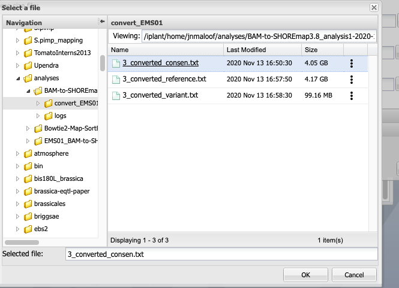

* `Candidate Marker Input` provides a list of known SNPs segregrating between Col and Ler.  This has been calculated and filled in for you.

When you are done your input window should look something like this:

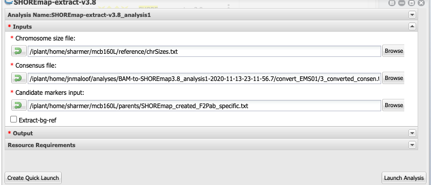

Click `Launch Analysis`! **This will take between 10 and 15 minutes to run.**

In your worksheet, answer the following question:

1) One file used as an input in the SHOREmap extract algorithm is called ‘SHOREmap_created_F2Pab_specific.txt’. This file, which was previously created for this lab, consists of a genome-wide list of SNPs between the Col and Ler accesssions. Explain how this information is used at this step of the analysis. (*You may wish to go back and read the introduction again.*)

___
## SHOREmap outcross

Click on the `Apps` button and search for SHOREmap.  You want `SHOREmap outcross` by REETU TUTEJA.  Click on the 3 dots to the right of the app and then on Quick Launch.

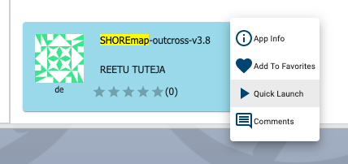

**Choose the Quick Launch that matches the EMSXX mutation you have been assigned.** Input parameters have been tuned for each mutation for you; normally, some trial and error would be required to obtain a clear-cut output.

### Input

Click on `Inputs`

* `Chromosome Size File` provides the length of each chromosome.  This has been filled in for you.
* `Marker File` provides a list of known SNPs segregrating between Col and Ler.  This has been calculated and filled in for you.
* `Consensus file`.  This the data from **YOUR** cross.  Click on `Browse`.  Navigate to your `analyses` folder, then the `SHOREmap extract` folder from the previous step.  Finally click on `extract` folder, then select `extracted_consensus_0.txt` and click OK.

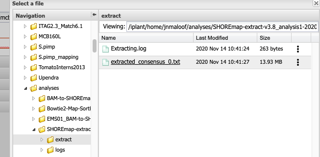

When you are done your input window should look something like this:

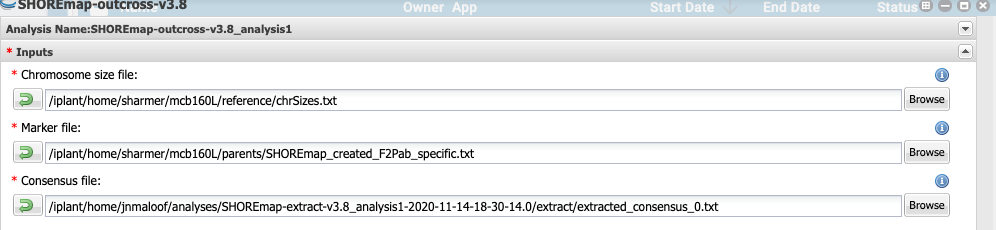

Now we are ready to launch.  Click the `Launch` button!

**This will take about 5 minutes to run.**

## View Outcross Results

Refresh the Analyses window after about 5 minutes. Once your SHOREmap outcross run is listed as complete, click on the 3 dots at the right of it and select `Go to output folder`.  In the resulting window, click on the `outcross` folder and then `OC_AF_visualziation_1_boost.pdf`.  This is a 5 page PDF with one page for each chromosome.

It is slow to load because so many points are plotted.

Scroll through the pages until you find a chromosome with a peak, something like what is shown below (*your peak will be in a different location*).

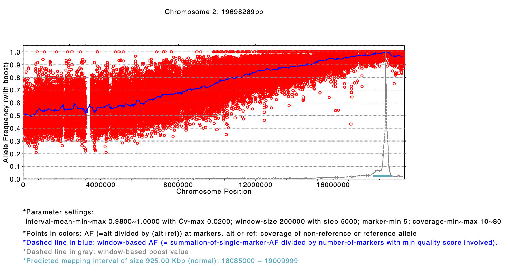

* The x-axis is position along the chromosome
* The y-axis is the allele frequency, with 1 = all Col and 0 = all Ler.
* Each red circle represents a SNP.
* The blue line is allele frequency averaged over 200,000 bp
* The gray line is the "boost" score, a statistic to boost signal relative to noise.
* The horizontal teal bar under the peak on the x-axis shows the predicted candidate interval for the gene. The coordinates of this are also give in the last line of text.

### Worksheet questions:
2) Does your mutation map to a single region?
3) What chromosomes(s) does your mutation map to?
4) What coordinates?
 ___
## Run SHOREmap annotate

Which of the mutations in the candiate region is likely to actually cause the mutant phenotype?  `SHOREmap annotate` identifies sequences in your pooled F2 reads that differ from those of the reference genome, tells you which of these candidate SNPS are in genes, and predicts whether or not they will cause a coding changes.

Click on the `Apps` button.  Search for `SHOREmap`, find `SHOREMAP annotate` by REETU TUTEJA, click on the three dots to the right of it and select `Quick Launch`.

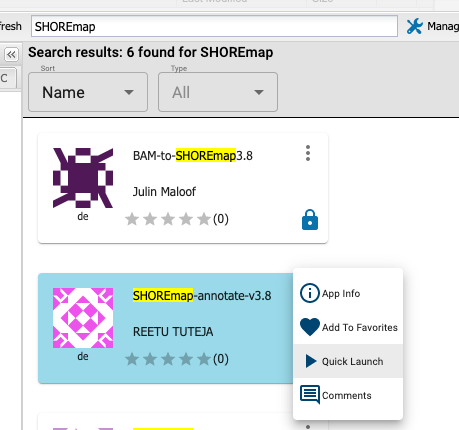

Next select the `MCB160L` Quick Launch.

### Inputs:

* `snp`: Click `Browse` and select the `3_converted_variant.txt` file that was output from the `BAM-to-SHOREmap` workflow from day 2.
* `crhom`: Enter the chromosome number that your mutation is on
* `start` and `end` enter the beginning and ending basepairs of the interval shown in the output of SHOREmap outcross (Depending on your viewer, you may be able to cut and paste the numbers from the last line of text on the PDF).

*__IMPORTANT! if the start shown on the PDF is 0, enter 1 instead.__*

The input window should look something like this when you are done (but chrom, start, and end may be different).

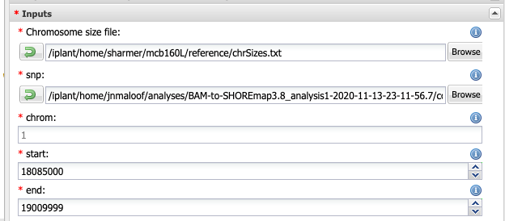

### Functional Annotation:

SHOREmap annotate needs to know where the genes are on the chromosomes.  We have pre-filled in these fields for you but if you want to make sure they are correct, click on `Functional Annotation` and confirm that it looks like the window below.  The Genome file provides the genomic sequence and the gff file provides gene location in the genome.

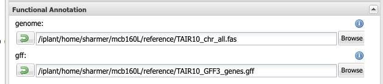

### Launch it!

Ready to Launch!  This will take about 5 minutes to run.
___
## Identify candidate genes

After about 5 minutes, refresh your analysis screen.  Once SHOREmap annotate is complete, click on the 3 dots to the right of the analysis and open the analysis folder.  Click on the `annotate` folder.

You will now download two files for use today and in our next lab. Click the check box on the `prioritized_snp...` file and the `ref_and_eco_coding_seq...` file.  Then click `Download > Simple Download` on the top menu bar to Download these to your computer.  *Keep track of where they are!*

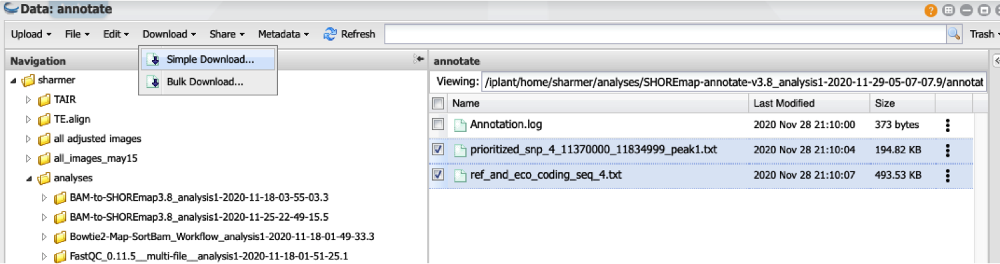

Open the `prioritized_snp...` file in Excel. You'll see that the columns are not labeled.  Go to the [SHOREmap guide page](http://bioinfo.mpipz.mpg.de/shoremap/guide.html) and scroll to very bottom. You'll see a table with 16 entries. Label the columns in your Excel file according to the information in this table.

You can use the Excel sort command to order the entries in your candidate SNP file.

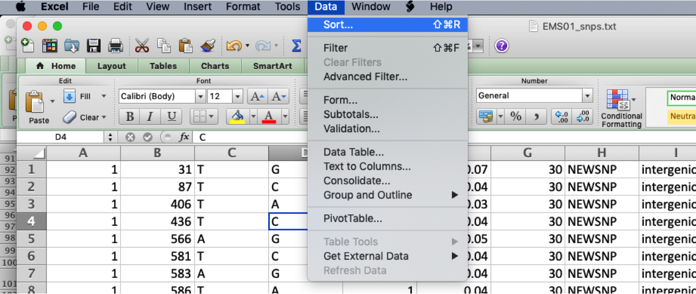

While in the Discovery Environment, dowload

### Worksheet questions:

5) First, sort on allele frequency.  What is the general distribution of AF values in your spreadsheet?  (_That is, does it look like an even distribution of values or is it skewed in some way?_)

6) What does allele frequency mean in this case?  That is, what exactly is being compared to generate these values, and what does a large value (close to 1) indicate?

7) Next, sort your spreadsheet on the base quality value. Is there a general relationship between allele frequency and base quality? If so, does this help explain the general distribution of AF values? Explain.

8) Go back and again sort your spreadsheet by allele frequency. Now examine the information given about the region of DNA affected by each polymporphism. Which type of region is most likely to be affected by the mutation causing the phenotype?

9) Now examine the last three columns in your spreadsheet.  The information here should help you further narrow down the sequence variants most likely to be causing the mutant phenotype. Briefly explain why this information is useful.

10) Data on this spreadsheet should allow you to identify somewhere between two and five mutations that are most likely to be causing your phenotype. Find the gene identifier for each of these candidates.  Write out these gene identifiers on your worksheet. (_Note gene models with the same prefix followed by different numbers, for examle AT1G01080.1 and AT1G01080.2, represent different mRNA splicing variants of the same pre-mRNA. For this lab, only consider the ATXGXXXXX.1 gene models._)

Enter the requested information into the [course Google sheet](https://docs.google.com/spreadsheets/d/1eavWUeG-VVbh4ZLXxyYcHM_g0yMk2xw3X15Yk84B7R4/edit?usp=sharing) by 10 pm this evening. Comparing information with your classmates may help you determine which sequence variant is causing your mutant phenotype.

___In our next lab, you will learn more about these candidate genes and the predicted effects of the mutations you have uncovered.___
