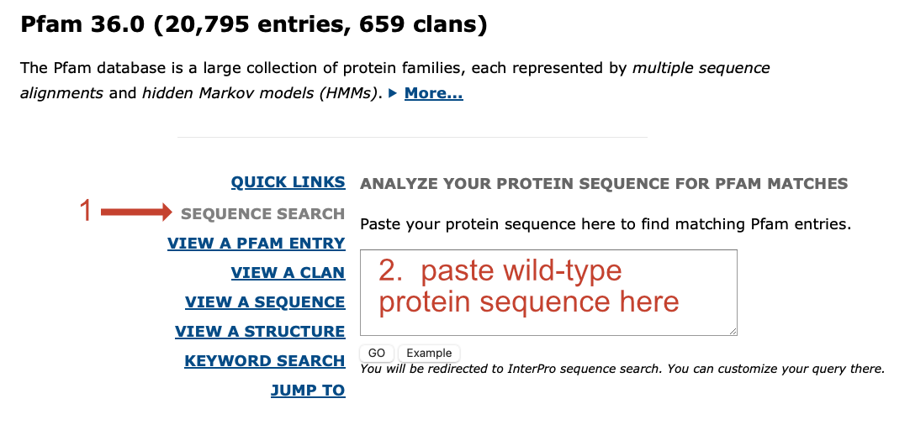
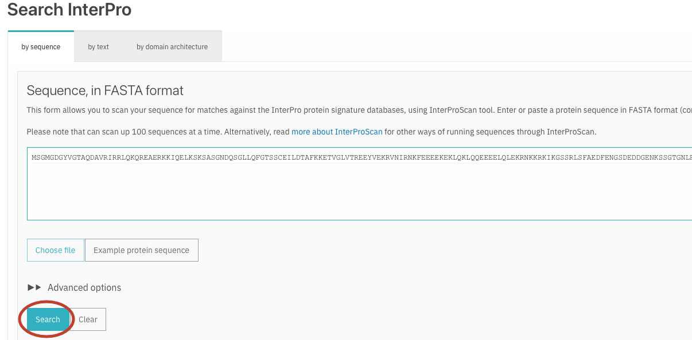
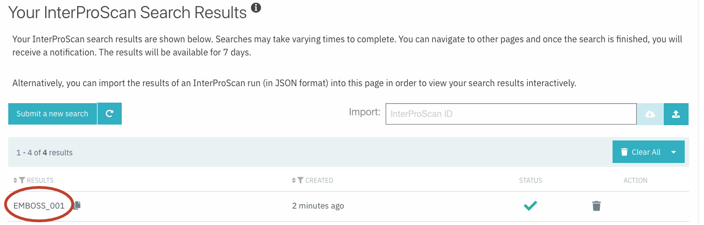
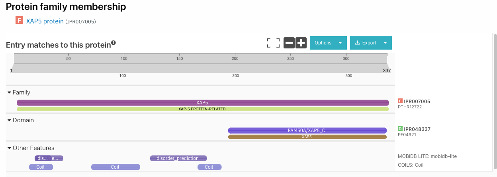
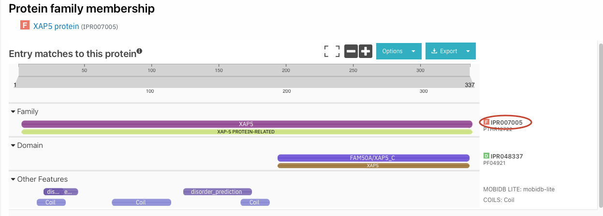
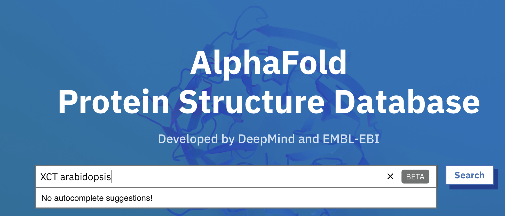
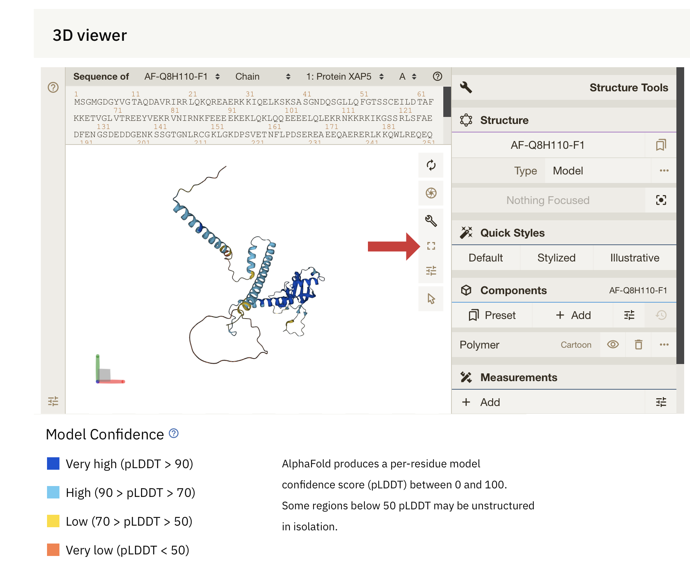
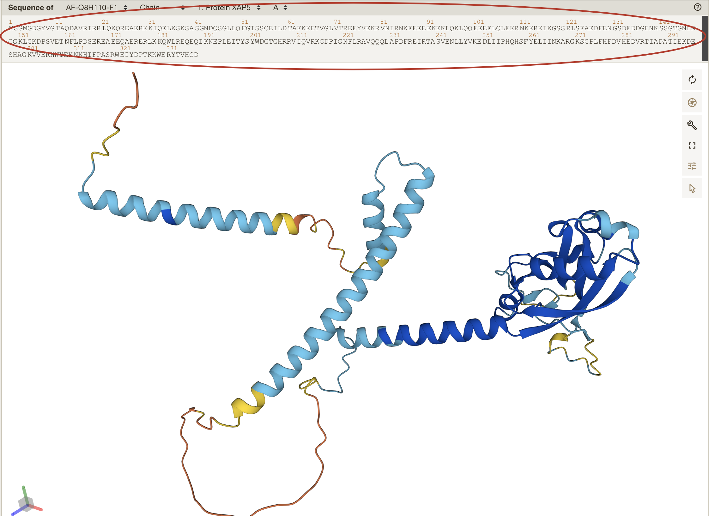

# Mapping mutants by Bulk Segregant Analysis and Illumina Sequencing
# Day 4: Identify top candidate gene

## Intro

At this point in the module, you have identified novel sequence variants that are genetically linked to the mutant phenotype in your F2 plants. These sequence variants are not present in the parental Col strain and are different from the Col/Ler SNPs you used to define the mutant interval.

Last time, you ran `SHOREmap annotate` to generate a file with a list of variant SNPs and the predicted effects of these SNPs on protein sequences. For all the mutant families we are characterizing, more than one gene in the interval has an alteration predicted to change the sequence of the encoded protein. Recall that the bright luciferase phenotype of these mutants is due to some defect in the generation or function of an amiRNA, so we expect the gene mutated in your plants normally acts in the miRNA pathway.

Your goal today is to use several different on-line resources to identify the single mutant gene most likely to be causing the miRNA phenotype in your F2 family.

**Before you proceed, be sure that your TA has signed off on your short list of candidate genes.**

Answer the below questions in your lab worksheet as you go along.

---

## Examine the types of mutations in your interval and identify a top candidate gene

Open the `prioritized_snp...` file that you generated in the last lab session in Excel. Again, sort on allele frequency.

1) Recall that `SHOREmap outcross` selected this interval because of the very low frequency of Ler alleles here. With this in mind, what are the two possible reasons for the alternate bases reported in the fourth column?

You can help distinguish between these two possibilities by focusing on sequence variants with a high allele frequency in your pooled F2 plants.

2) Identify all of the sequence variants with an allele frequency greater than 0.9.  Write out all the types of alterations that you see (i.e. ref base X --> alt base Y, *etc.*) and note how often they occur. Based on what you learned in lecture, is this what you would expect given that EMS was the mutagen?  Briefly explain.

Last time, you identified somewhere between two and five candidate genes in your mutant interval. Now, you will do a quick database search to learn what is currently known about the functions of these genes.

Go to [The Arabidopsis Information Resource (TAIR)](https://www.arabidopsis.org) to learn more about your candidates.

One-by-one, enter the identifiers of the candidate genes (e.g. AT2G21150) into the search bar at the top of the and click 'Search'.

You may see multiple hits on the next page. If so, click on the hyperlink that exactly matches the gene identifier you searched on.

You will be taken to a page with a lot of information about your candidate gene.  Start out by reading the overview of known functions at the top of the page.

Then, scroll to the bottom of the page to see links to publications about this gene. If any of these look particularly relevant to the phenotype we are studying, click on the link to see the abstract of the paper. If there are a lot of publications for your genes, you might try searching on 'miRNA' or 'small RNA' to quickly find relevant papers.

On this page, you will see a link that will take you to the full journal article if you want to read more.

After going though this process for all of your candidate genes, you should be able to identify **one** as your top candidate.

*Note that this is often not the case; frequently a literature search wouldn't allow you to identify a top candidate so easily.*

3) Based on information you found on TAIR, what gene do you think is most likely to be causing your phenotype?

#### *Check in with your TA on the identity of your top candidate before you continue.*

---

## Predict whether the mutation in your top candidate is likely to affect protein function

Although new experiments would be required to __*prove*__ that the mutation you've identified has affected the function of your candidate protein, we can take advantage of on-line resources to make some predictions.

First, we'll identify which amino acid is altered in your mutant protein.  To do this, we'll now open a second output file generated by `SHOREmap annotate`.  You should have downloaded a file called  `ref_and_eco_coding_seq...` in our last session (*if you didn't, follow the instructions from our last lab and download it now*).

Open this file using Word.  Search for the gene identifier of you top candidate. You will find an entry that looks similar to what is shown below (although probably longer)

The first section shows the nucleotide sequence of the reference version of the gene and the second section shows the sequence of the mutant allele (bases identical to the reference are indicated by dashes; the mutant base is circled and labeled __#1__).

The third section shows the amino acid sequence of the reference version of the protein and the fourth section shows the sequence of the mutant allele (amino acids identical to the reference are indicated by dashes; the mutant amino acid is circled and labeled __#2__). Note that the stop codon is indicated with a * symbol.

For the next section of the lab, you will need to know the amino acid sequence of the wild-type protein and the position and nature of the mutation in your top candidate.

4) Copy and paste the wild-type sequence of your top candidate protein in your worksheet.

You can use the Tools -> Word Count function in Word to count the number of amino acids in your protein and to find the numeric position of the amino acid mutated in your protein.

Alternatively, you can go back to your candidate SNP excel file and identify the affected amino acid there.  The 12th column (called "the numerical order of the codon having the mutation" in the [SHOREmap guide](http://bioinfo.mpipz.mpg.de/shoremap/guide.html)) identifies the variant nucleotide causing the amino acid alteration on each row. In the example below, nucleotide #572 is predicted to cause the V to A mutation.  Since there are 3 nucleotides per codon, we can determine the position of the affected amino acid in the protein by dividing by 3:

572/3 = 190.67, or codon 191 is affected (and thus amino acid #191).

Answer the below question on your worksheet.

5) What is the position and nature of the mutation in your protein?  For example, if the reference sequence had a threonine (T) at position 541 but your mutant protein is predicted to have a valine (V) residue at that position, you would write:  T541V.

Now you will use this information to determine whether your predicted mutation lies in a region of the protein that has a known function or that folds into a well-defined shape (a protein domain).

#### Pfam query and analysis

Go the [Pfam website](http://pfam.xfam.org). Here, you will search the wild-type protein sequence against a database containing about 18,000 different protein domain models. From this, you'll be able to learn whether your mutation lies within a region known to have specific function.

Once you're on the Pfam page, click on the 'SEQUENCE SEARCH' link and paste in your wild-type protein sequence in the text box.  Be sure you only include the one-letter amino acid codes and nothing else.  Click 'Go'.

You'll be taken to a page where you could modify the standard search options.  Don't do that; instead, just press the 'Search' button.

Depending on the number of requests queued at the server, it may take up to a few minutes for your search to compete. Once you see a search result, click on the link.

You'll be taken to a page similar to the one shown below. 

This schematic shows whether your candidate protein falls into a general family (first section), whether it has recognizable domains (second section), and if there are other features of interest in the sequnce (third section).

We are particularly interested in protein domains, as these are distinct functional and/or structural units within a protein. Changes to the amino acid sequence within a conserved protein domain are more likely to affect protein function than changes in other portions of a protein.

Determine whether your mutation of interest falls within a recognized protein domain by holding your mouse over each listed domain and noting which amino acids it encompasses (these are the numbers in the box below the domain name when you mouse over it).  

If it does, click on the domain name (to the right of the cartoon) and see what you can learn about its function.

6) Does your protein have any recognized domains?  If so, write them all out below. (Domains can have multiple names. Just write out the first name shown for each specific portion of the protein.) Write out the amino acids that each domain covers.

7) Does your top candidate mutation fall within any of these predicted domains? If so, which domain?

If so, click on this domain name (to the right of the cartoon) and see what you can learn about its function.

8) Does this help you decide whether or not your mutation might affect protein function?  Explain.

#### Structural analysis

One example of how artificial intelligence is revolutionizing biology (and other disciplines) is in the prediction of protein structures. 

Go to [The AlphaFold Protein Structure Database](https://alphafold.ebi.ac.uk) to learn more about your candidate proteins.

In the search bar, type in the gene name of your top candidate along with the word 'Arabidopsis' and click on 'Search'.

There may be multiple structures listed on the results page; click on the name of the topmost one (even if it doesn't exactly match the search term you typed in).  

Scroll down a bit to the '3D viewer' section.  Click on the 'Toggle' key to get a larger view of the predicted structure.  
 

Now use your mouse to zoom in, zoom out, and rotate the structure. You'll see some regions that have have specific folds and other regions that appear unstructured. Use your mouse to rotate the protein structure to look at it from multipe angles. Note that different regions of the structure have different colors; these correspond to the confidence in the structure (dark blue = very high confidence --> orange = very low confidence).

You'll also see the primary amino acid sequence of your protein at the top of the screen. 
 

Click on the number of the amino acid that is altered in *your* Arabidopsis mutant. This will zoom you in to the section of the protein where this residue can be found. 

9) What is the pLDDT score for this residue? (Look in the box in the lower right corner as you mouse over the residue.) Is this a region where the confidence in the structure is very high, very low, or somewhere in between?       

10) Is it located within a well-folded protein domain? (You may need to zoom in and out to determine this).

11) Is this amino acid part of an alpha helix, a beta sheet, or a turn?  If so, which?

12) Is the side chain of this amino acid predicted to undergo chemical interactions with other parts of the protein? (Look for the dotted lines when you zoom in.) If so, list them here.

Use all of the information from Pfam and AlphFold to conclude whether or not the observed mutation(s) is likely to alter the function of your candidate.  

## Bringing it all together

Use all of the information you've gathered today to discuss whether or not the mutation you've found is likely to be responsible for the mutant phenotype (remember, the screen was for mutant plants that have high levels of luciferase enzyme activity). From what you've learned about the candidate gene on TAIR, do you think it could cause the observed phenotype? From what you've learned on Pfam and AlphaFold, do you think the specific mutation you found is likely to alter protein function? (If you found two mutations within your candidate protein, discuss which would be most likely to alter protein function.)