# Mapping mutants by Bulk Segregant Analysis and Illumina Sequencing
# Day 4: Identify top candidate gene

## Intro

At this point in the module, you have identified novel sequence variants that are genetically linked to the mutant phenotype in your F2 plants. These sequence variants are not present in the parental Col strain and are different from the Col/Ler SNPs you used to define the mutant interval.

Last time, you ran `SHOREmap annotate` to generate a file with a list of variant SNPs and the predicted effects of these SNPs on protein sequences. For all the mutant families we are characterizing, more than one gene in the interval has an alteration predicted to change the sequence of the encoded protein. Recall that the bright luciferase phenotype of these mutants is due to some defect in the generation or function of an amiRNA, so we expect the gene mutated in your plants normally acts in the miRNA pathway.

Your goal today is to use several different on-line resources to identify the single mutant gene most likely to be causing the miRNA phenotype in your F2 family.

**Before you proceed, be sure that your TA has signed off on your short list of candidate genes.**

Answer the below questions in your lab worksheet as you go along.

---

## Examine the types of mutations in your interval and identify a top candidate gene

Open the `prioritized_snp...` file that you generated in the last lab session in Excel. Again, sort on allele frequency.

1) Recall that `SHOREmap outcross` selected this interval because of the very low frequency of Ler alleles here. With this in mind, what are the two possible reasons for the alternate bases reported in the fourth column?

You can help distinguish between these two possibilities by focusing on sequence variants with a high allele frequency in your pooled F2 plants.

2) Identify all of the sequence variants with an allele frequency greater than 0.9.  Write out all the types of alterations that you see (i.e. ref base X --> alt base Y, *etc.*) and note how often they occur. Based on what you learned in lecture, is this what you would expect given that EMS was the mutagen?  Briefly explain.

Last time, you identified somewhere between two and five candidate genes in your mutant interval. Now, you will do a quick database search to learn what is currently known about the functions of these genes.

Go to [The Arabidopsis Information Resource (TAIR)](https://www.arabidopsis.org) to learn more about your candidates.

(*You should have more than enough free page views at TAIR to do today's assignment. However, if you receive a message saying you need to subscribe to view more pages, [VPN into the university library](https://www.library.ucdavis.edu/service/connect-from-off-campus/vpn-questions-known-issues/) to gain access.*)

One-by-one, enter the identifiers of the candidate genes (e.g. AT2G21150) into the search bar at the top of the and click 'Search'.

You may see multiple hits on the next page. If so, click on the hyperlink that exactly matches the gene identifier you searched on.

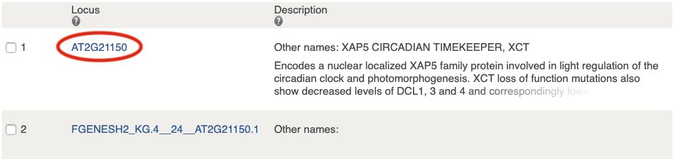

You will be taken to a page with a lot of information about your candidate gene.  Start out by reading the overview of known functions at the top of the page.

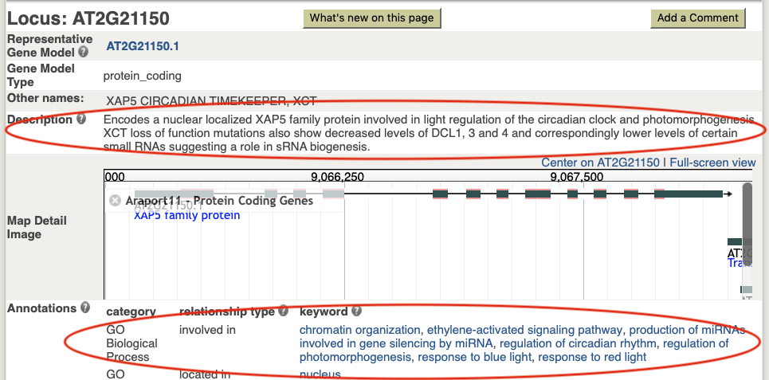

Then, scroll to the bottom of the page to see links to publications about this gene. If any of these look particularly relevant to the phenotype we are studying, click on the link to see the abstract of the paper.

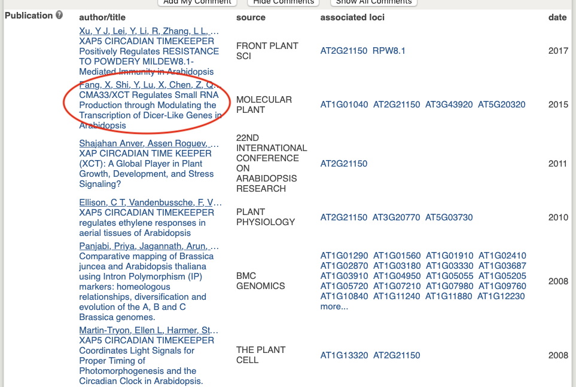

On this page, you will see a link that will take you to the full journal article if you want to read more.

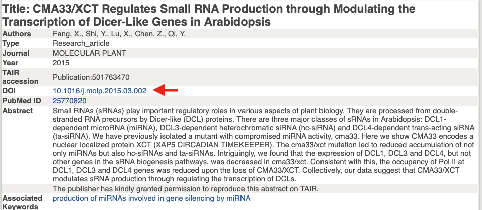

After going though this process for all of your candidate genes, you should be able to identify **one** as your top candidate.

*Note that this is often not the case; frequently a literature search wouldn't allow you to identify a top candidate so easily.*

3) Based on information you found on TAIR, what gene do you think is most likely to be causing your phenotype?

#### *Check in with your TA on the identity of your top candidate before you continue.*

---

## Predict whether the mutation in your top candidate is likely to affect protein function

Although new experiments would be required to __prove__ that the mutation you've identified has affected the function of your candidate protein, we can take advantage of on-line resources to make some predictions.

First, we'll identify which amino acid is altered in your mutant protein.  To do this, we'll now open a second output file generated by `SHOREmap annotate`.  You should have downloaded a file called  `ref_and_eco_coding_seq...` in our last session (*if you didn't, follow the instructions from our last lab and download it now*).

Open this file using Word.  Search for the gene identifier of you top candidate. You will find an entry that looks similar to what is shown below (although probably longer)

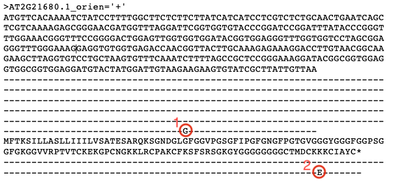

The first section shows the nucleotide sequence of the reference version of the gene and the second section shows the seuqence of the mutant allele (bases identical to the reference are indicated by dashes; the mutant base is circled and labeled __#1__).

The third section shows the amino acid sequence of the reference version of the protein and the fourth section shows the sequence of the mutant allele (amino acids identical to the reference are indicated by dashes; the mutant amino acid is circled and labeled __#2__). Note that the stop codon is indicated with a * symbol.

For the next section of the lab, you will need to know the amino acid sequence of the wild-type protein and the position and nature of the mutation in your top candidate.

4) Copy and paste the wild-type sequence of your top candidate protein in your worksheet.

You can use the Tools -> Word Count function in Word to count the number of amino acids in your protein and to find the numeric position of the amino acid mutated in your protein.

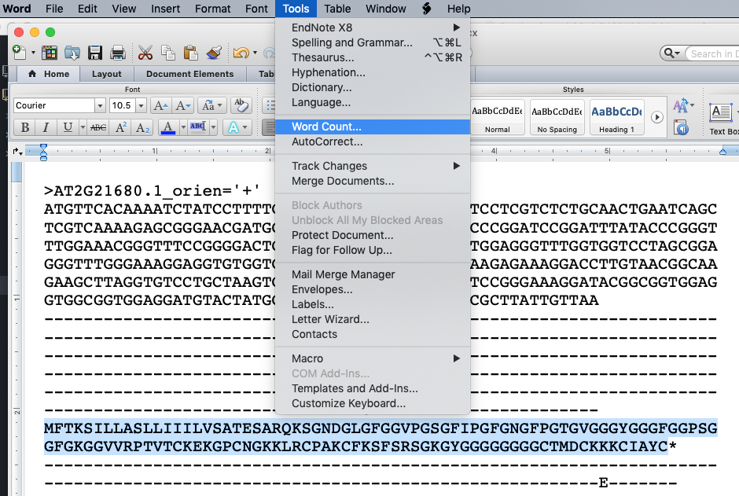

Alternatively, you can go back to your candidate SNP excel file and identify the affected amino acid there.  The 12th column (called "the numerical order of the codon having the mutation" in the [SHOREmap guide](http://bioinfo.mpipz.mpg.de/shoremap/guide.html)) identifies the variant nucleotide causing the amino acid alteration on each row. In the example below, nucleotide #572 is predicted to cause the V to A mutation.  Since there are 3 nucleotides per codon, we can determine the position of the affected amino acid in the protein by dividing by 3:

572/3 = 190.67, or codon 191 is affected (and thus amino acid #191).

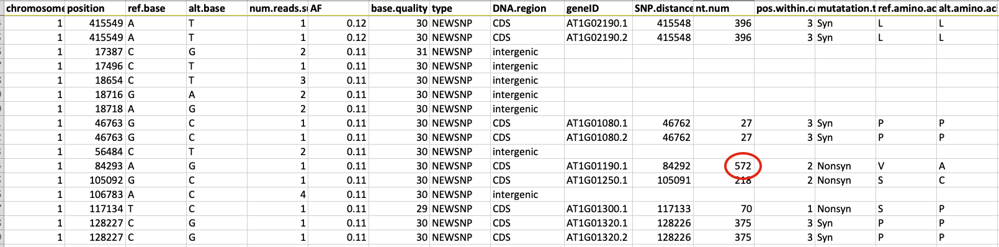

Answer the below question on your worksheet.

5) What is the position and nature of the mutation in your protein?  For example, if the reference sequence had a threonine (T) at position 541 but your mutant protein is predicted to have a valine (V) residue at that position, you would write:  T541V.

Now you will use this information to determine whether your predicted mutation lies in a region of the protein that has a known function (a protein domain).

#### PROVEAN query
First, you will start a query running on a site called [PROVEAN](http://provean.jcvi.org/seq_submit.php).  This search can be slow to run, so you will start it now and come back later to analyze the output. The purpose of this analysis will be described below.

Go to the [Provean](http://provean.jcvi.org/seq_submit.php) site. Paste in your wild-type protein sequence and the variant predicted in your mutant in the indicated boxes.

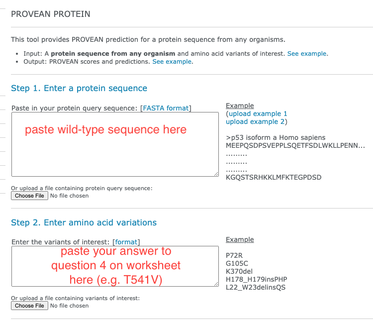

**Provide your email address** before you click 'Submit' as it can be slow to run (up to 15 minutes) and you will likely navigate away from this screen while it is running.

#### Pfam query and analysis

Go the [Pfam website](https://pfam.xfam.org). Here, you will search the wild-type protein sequence against a database containing about 18,000 different protein domain models. From this, you'll be able to learn whether your mutation lies within a region known to have specific function.

Once you're on the Pfam page, click on the 'SEQUENCE SEARCH' link and paste in your wild-type protein sequence in the text box.  Be sure you only include the one-letter amino acid codes and nothing else.  Click 'Go'.

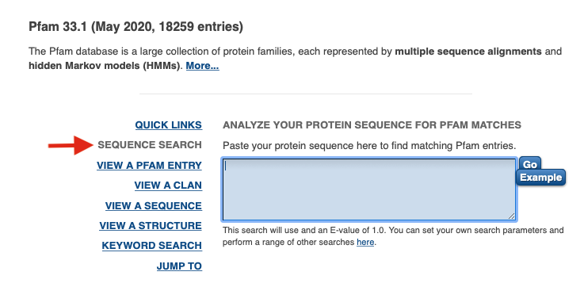

Depending on the number of requests queued at the server, it may take up to a few minutes for your search to compete.

You'll be taken to a page with a cartoon view in which any detected domains are highlighted. Below this schematic view will be detailed information about how well your sequence matches the domain model(s).  The numbers under 'Alignment' indicate the starting and ending amino acids of your protein that match the indicated protein domain(s).

The other circled number is the E-value. This is similar to the E-values you get back from BLAST searches. This value represents the number of hits that would be expected to have a score equal to or better than this value by chance alone.

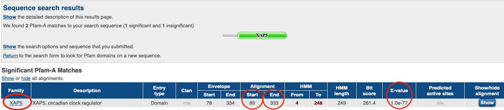

Determine whether your mutation of interest falls within a recognized protein domain.  If so, click on the corresponding hyperlink for the domain 'Family' name (far left) to open up the link in a new window.

Use the above information to answer the questions on your worksheet.

6) Does your protein have any recognized (significant) Pfam-A domains?  If so, write them all out below.

7) Does your top candidate mutation fall within any of these predicted domains? If so, which one?

If so, click on this domain name and see what you can learn about its function.

8) Does this help you decide whether or not your mutation might affect protein function?  Explain.

#### PROVEAN analysis

While knowing what region of the protein is affected by your candidate mutation is very useful, it is also important to consider the **specific nature** of the alteration in the mutant. For example, is the mutated residue one in which an amino acid with a small nonpolar side chain is exchanged for another (e.g. alanine replaced with glycine)?  Or do the wild-type and mutant side chains have very different chemical properties (e.g. arginine replaced with proline)?

Another important piece of information is how conserved that particular amino acid is across all known homologs of the protein of interest. For example, substitution of a residue that is highly conserved in all known  homologs of this protein is more likely to have a negative effect on function than substitution of a residue that is not conserved (compare amino acids 2 and 1 in the below alignment to see poorly conserved and highly conserved residues).

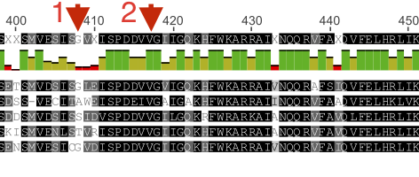

[PROVEAN](http://provean.jcvi.org/seq_submit.php) will analyze the sequence of your mutant portein, taking into account both the nature of the amino acid substitution and how well this site is conserved across homologous proteins.  It will then predict how likely it is that your specific mutation will affect protein function.

The search that you submitted earlier today should have finished by now.  Either check your email for a notification from PROVEAN or directly navigate back to your search page.  Use this information to complete the last section of the worksheet.

9) What is the prediction score you received from PROVEAN?  What effect does PROVEAN predict this mutation will have on the function of the protein?

**In our next lab (day 19), we will compare the top candidate mutants identified in each of the EMSXX families and discuss strategies to prove that the identified mutations are truly causing the miRNA-related phenotype.**
